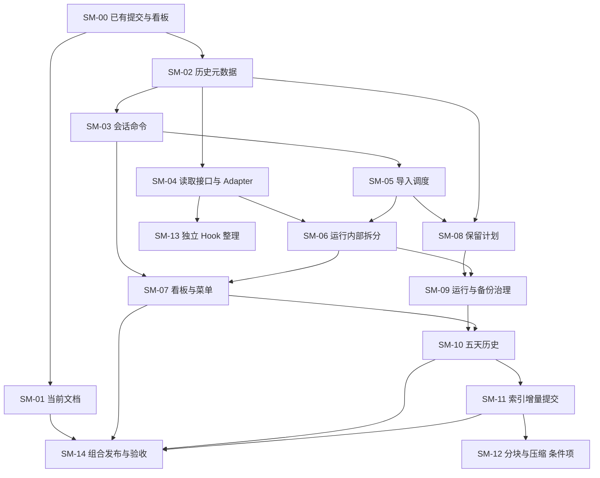

# Session Maintenance 修改施工计划

日期：2026-09-05。状态：计划已编制，待按批次施工；现有功能保持为验收基线。

## 1. 目标、依据与提交状态

目标：恢复看板入口，修复历史版本元数据，减少跨模块的具体实现依赖，降低追加和存储成本，并建立五天历史保留能力。继续采用单仓库、本地 Engine、可替换 Adapter 的结构。

依据：[审查报告存档](/D:/AI/DSH-Plugin-Repositories/.worktrees/maintenance-dashboard-audit-20260905/docs/validation/2026-09-05-maintenance-architecture-review.md)。原报告的问题编号 E01、P02、W01、A01–A06、D01、U01 在本计划中保持可追溯。

| 基线 | 核查结果 | 施工处理 |
| --- | --- | --- |
| `4b499271e9b8bc09de09f0dab3c5321d25f0104c` | 身份、删除与 RC1 空会话修复已经提交；本轮远端查询确认 `origin/codex/rc1-conversation-topology-repair` 也是这个提交 | 纳入所有后续分支祖先，不重复提交或用旧源码覆盖 |
| `a6b40531bdbd149b9a0232de64e89c78c4a5f344` | 看板自动发现补丁已本地提交，20 项相关测试、类型检查、构建与独立 CLI 验证通过；尚未部署 | 作为本计划的源码起点，正常发布时承接 |
| Engine / 插件版本 | Engine 0.1.14、Maintenance 0.2.16；配套 SCM 0.3.1 | 发布批次由协调者统一分配新版本，不让各代理自行改版本号 |
| Launcher | 工作树 `D:/AI/DSH-Launcher/worktrees/runtime-hook-seam`，HEAD `957e172`；五个既有未提交文件 | 作为另一条修改链保护；SM-13 开始前先核对其最新状态 |

本计划的 Git 提交只保存计划、审查存档及变更说明，不启动数据迁移、真实目录回收或运行切换。运行数量和空间统计属于审查时快照；上线前重新读取。

## 2. 必须保持的行为

1. Codex 原始会话只读；在 DSH 中续写时保留正确的来源与派生关系。
2. 会话、事件、工作区与项目的稳定身份不因内部拆分改变；同名会话仍准确区分。
3. 保留 `4b49927` 的原生 ID、已证明身份的运行与逻辑 ID 映射，以及删除回执后再隐藏的顺序。
4. 保留 RC1 官方空会话生命周期，不写伪造消息，不取消引用系统的保护检查。
5. WAL、幂等操作 ID、提交回执、待提交写入和恢复证据继续有效。
6. Adapter 负责版本格式，Engine 负责业务协调；共享 DTO 进入 `packages/contracts`。
7. 历史保留不删除仍保留会话的当前内容，不改写既有版本 ID 或父版本关系。
8. 已验证的业务行为通过同一组回归约束；不以“拆了多少文件”作为成功标准。

执行遵守 [AGENTS.md](/D:/AI/DSH-Plugin-Repositories/.worktrees/maintenance-dashboard-audit-20260905/AGENTS.md)：使用带标记的合成测试目录；每个施工项有针对性验证、Markdown 变更报告和一个可独立审查的提交。真实实例操作与源码施工分开记录。

## 3. 代理分工和防覆盖办法

统一使用 `gpt-6-astra`。按四类职责轮转，最多同时运行三个子代理，协调者负责集成。强度根据任务难度选择，不按三个档位各固定一名代理；表中是本计划建议配置，实际派发以具体施工项为单位。

| 职责 | 建议思考强度 | 负责施工项 | 文件职责 |
| --- | --- | --- | --- |
| A：历史版本、存储与性能 | 极高 `xhigh` | SM-02、08、09、10、11、12 | 版本存储、对象存储、保留策略和性能改动 |
| B：会话命令与导入调度 | 高 `high` | SM-03、05 | Engine 会话用例、HTTP 适配、导入任务和写入协调 |
| C：Adapter、运行接入与 Hook | 高或极高；SM-06 用极高 | SM-04、06、13 | Adapter 注册与投影读取、运行状态协调、Provider 和宿主协议 |
| D：看板、菜单与文档 | 中 `medium` | SM-01、07；协助 SM-00 | 界面入口、状态呈现、使用与接入文档；复用 B/C 给出的契约 |
| 主协调者 | 统筹 | SM-00、14，各批集成 | 共享契约、迁移序号、组装入口、锁文件、版本及组合产物 |

防覆盖约束：

- 每个活跃代理使用自己的工作树，从已经包含依赖项的提交开始；不能在主工作目录或另一代理工作树执行切分支、重置或批量暂存。
- 派发单列出：父提交、允许修改文件、依赖提交、验收命令、交付报告路径。交付必须报告实际提交和剩余问题。
- `packages/contracts`、数据库迁移登记、`composition-root.ts`、公共导出、包版本及锁文件由协调者管理。代理提出变更后，由协调者串行整合；不得复制一套契约绕开它。
- `canonical-engine-store.ts` 的 SM-02、11 和后续格式改动串行；`http/dashboard.ts` 的 SM-02 最小修复先完成，SM-03 再做结构迁移；SM-07 最后接消费接口。
- SM-04 新增的投影读取仓库与 A 的版本仓库分开；公共导出及迁移改动串行提交。
- 集成前检查依赖仍在祖先中、最近是否有另一会话的新提交；发生冲突时逐项保留行为，禁止整文件用旧版本覆盖。
- Launcher 既有五个未提交文件不进入 Maintenance 提交。SM-13 先审查既有差异，再在 Launcher 仓库形成独立提交。

无需让四类代理持续占用资源。没有独立可推进工作时收回代理；存储任务串行期间不为凑并行度增加代理。

## 4. 批次、依赖与交付顺序

| 批次 | 施工项 | 交付目的 | 并行安排 |
| --- | --- | --- | --- |
| 0：基线与入口 | SM-00、01 | 承接已提交修复，准备看板交付，统一现状文档 | 协调者处理基线，D 写文档 |
| 1：历史正确性 | SM-02 | 历史元数据独立、摘要一致、旧数据状态明确 | A 实施；D 可继续文档，其他代理不抢版本写入文件 |
| 2：模块边界 | SM-03、04、05、06、07 | 统一会话命令、投影读取、Adapter、导入和界面入口 | 初始 B 做 03、C 做 04；随后按依赖轮转，最多三个子代理 |
| 3：存储治理 | SM-08、09、10 | 先解释可回收数据，再治理运行副本和五天历史 | A 按序实施；D 接状态展示；暂不与格式改造并行 |
| 4：追加性能 | SM-11；条件满足后 SM-12 | 先减少索引写入，再根据测量优化正文格式与压缩 | A 负责写入；D 在读契约确定后实现范围呈现 |
| 5：宿主与发布 | SM-13、14 | 保留可升级的 Hook 接入，完成组合验收与分批发布 | SM-13 独立推进；不阻塞无需改宿主的 Engine 修复 |

图中的顺序用于控制同文件交叉施工；不表示必须等所有工作完成才能交付看板。看板、历史正确性、内部重构、保留功能可以分别发布。SM-12 为测量后决定的后续格式项目；SM-13 在独立 Launcher 仓库验收并提交，不要求捆绑升级。

## 5. 逐项施工说明

### SM-00：承接基线并准备看板交付（W01）

- 状态：源码修复已经在 `a6b4053`，不重做。后续补齐发布清单与真实入口验收记录。
- 范围：[看板目录发现](/D:/AI/DSH-Plugin-Repositories/.worktrees/maintenance-dashboard-audit-20260905/apps/engine/src/dashboard-root.ts)、CLI、打包验证及部署文档。
- 步骤：核对基线祖先；确认发布包包含 Dashboard；正常停止 DSH、排空待提交写入后切换 Engine；验证插件入口的认证跳转、页面和应用脚本。
- 验收：无目录参数的启动、便携包布局、显式配置、无 UI 安装、未授权 API 拒绝均保持正确；身份/删除/空会话回归继续通过。
- 退出条件：实际运行切换与浏览器验收单独记录。仅有代码通过测试不能标成“线上已恢复”。代码回退使用上一份完整构建，无数据库迁移。

### SM-01：更新当前架构、支持范围与发布关系（D01）

- 负责人 D，中；依赖 SM-00 的基线确认。
- 范围：README、Adapter/Hook 接入、部署和恢复文档；承接指定会话 20:54 的产品定位建议。
- 步骤：明确 Engine、WebUI、DSH 插件、Adapter、Provider 和 Launcher 的责任；把 Codex 导入与启动投影区分；将旧 RC2 Gateway 阶段说明转为有适用条件的历史说明。
- 验收：文档能对应当前源码和发布产物；支持矩阵只列已验证组合；命令与链接校验通过。不为纯文档修改新增业务测试。
- 交付：一个文档提交及 `docs/changes/SM-01.md`，不改变现有运行参数。

### SM-02：历史元数据快照与兼容迁移（E01）

- 负责人 A，极高；依赖 SM-00。优先于版本裁剪和大范围存储重构。
- 范围：[版本存储](/D:/AI/DSH-Plugin-Repositories/.worktrees/maintenance-dashboard-audit-20260905/packages/session-store/src/canonical-engine-store.ts)、领域版本构建/派生、所有版本写入入口和契约；涉及 HTTP 元数据写入口的最小衔接由协调者整合。
- 实施：新增以版本 ID 为键的元数据快照存储，优先使用独立表，保存完整元数据、来源及可用状态；与版本记录在同一事务中提交。枚举普通提交、Codex 观察、快速改名、导入/迁移等入口，禁止只修读取端。
- 更新标题、标签和归档时统一明确版本语义。需要生成元数据版本的路径复用同一写入操作，避免看板直接改当前表后再次造成摘要脱节。
- 旧数据：只有候选元数据的摘要匹配已存摘要时才能恢复；不可恢复者标为未知，正文继续可读。历史比较或派生不得静默把当前元数据当成旧值；必要的状态由契约明确传到界面。
- 为后续保留记录可信的本地首次保存时间；不要将 Codex 原始会话日期或文件修改时间直接用作五天窗口起点。旧版本缺少可信时间时保守保护。
- 验收：改名/标签/归档后旧版本不变；快速改名和普通写入结果一致；读取与写入的各类摘要分别符合定义；历史派生不串用当前元数据；迁移重复执行、事务失败均安全；版本 ID、正文和父边保持。
- 现有测试入口：`canonical-engine-store.test.ts`、`derivation.test.ts`、`codex-catalog-title-sync.test.ts`、`canonical-dashboard-api.test.ts`；新增聚焦的迁移与回归用例。
- 交付：代码、测试、`docs/changes/SM-02.md` 和一个提交。迁移号由协调者分配（当前源码登记至 016）；升级后的库不能直接交给只支持旧 schema 的二进制。

### SM-03：统一会话命令与查询（A01）

- 负责人 B，高；依赖 SM-02。
- 范围：[看板接口](/D:/AI/DSH-Plugin-Repositories/.worktrees/maintenance-dashboard-audit-20260905/apps/engine/src/http/dashboard.ts)、HTTP 路由、Engine 用例和存储接口。
- 实施：将修改元数据、逻辑删除、恢复、Checkpoint 和相关投影调整移入统一业务操作；界面/HTTP 只解析输入、调用操作和映射结果；读取目录、详情、运行状态通过查询接口。
- 保持“解析精确身份 → 同一事务或同等原子边界内验证并修改 → 回执”。不能在目标解析与删除之间引入不受保护的异步间隙。
- 验收：同名、已关闭运行、缺失映射、重复删除、待提交写入、删除恢复及 Checkpoint 行为一致；metadata 快照回归通过；未认证请求仍拒绝。
- 交付：`docs/changes/SM-03.md` 和一个提交。优先搬迁实际业务，不增加只有转发作用的多层包装。

### SM-04：投影读取接口与 Adapter 单一注册（A02、A03）

- 负责人 C，高；依赖 SM-02；可与 SM-03 并行。
- 范围：[投影数据读取](/D:/AI/DSH-Plugin-Repositories/.worktrees/maintenance-dashboard-audit-20260905/packages/projection-lifecycle/src/materialize.ts)、Store 中新增读取实现、Adapter Host/Registry、组装入口。
- 实施：将 `SqliteCanonicalProjectionSource` 的 SQL 实现移入 Store；投影仅接收读取接口；Registry 依赖仓库接口；统一清单、探测和运行实现登记，移除重复 alpha2/RC1/RC2 选择分支。
- 验收：三类已支持 Adapter 选择正确；不支持的格式明确拒绝；同样输入的投影、变更游标和缓存复用结果一致；通过接口可替换合成读取实现；保留禁用旧 Native Mirror 的约束。
- 交付：`docs/changes/SM-04.md` 和一个提交；公共契约/导出与组装改动由协调者串行整合。

### SM-05：统一 Codex 导入和维护写入调度（A05）

- 负责人 B，高；依赖 SM-03。
- 范围：Codex Import Service、Engine 作业入口、现有 `jobs`、导入脚本以及写入租约/协调接口。
- 实施：在线导入进入 Engine 作业；脚本在线模式调用同一入口，脱机模式验证独占条件；标题观察与正文导入复用身份规则、游标与提交入口。为后续回收提供可验证的写入协调条件。
- 验收：重复任务不重复提交；同一会话并发导入与追加保持一致；在线/脱机冲突明确拒绝；中途取消与恢复可追踪；Codex 源目录摘要前后相同。不能仅依赖“SQLite 会锁”证明业务串行化。
- 交付：`docs/changes/SM-05.md` 和一个提交。性能改善由实测决定，本项不承诺未验证的导入加速。

### SM-06：拆分运行和插件内部职责（A04）

- 负责人 C，极高；依赖 SM-04、05。
- 范围：Projection Lifecycle、Runtime Broker、插件 `projection-runtime.ts` 及其辅助实现。
- 实施：保留一个运行生命周期协调入口，将准备/按需载入、追加/确认、停止/恢复、缓存管理作为内部模块；运行身份和幂等状态不复制到各模块自行管理。
- 验收：正常准备与收尾、重复关闭、准备后启动失败、在途追加时停止、恢复后再启动、旧缓存复用、长 operation ID 的 WAL；RC1 空会话只有必要持久化头且事件数仍为零。
- 现有测试入口：投影包的 `open-run`、`append`、`close-recovery`、`persistent-lifecycle`，Engine 的 `runtime-broker`、`external-lifecycle-provider`，插件的 `empty-projection-rc1`。
- 交付：`docs/changes/SM-06.md` 和一个提交。先保行为再移动职责，不更改磁盘投影格式或稳定事件身份。

### SM-07：统一菜单动作与可理解的看板状态（U01 剩余入口问题）

- 负责人 D，中；依赖 SM-03、06；保留 SM-00 已完成的服务端修复。
- 范围：Maintenance 插件入口与看板；SCM 的动作登记属于配套仓库，先核对当前 0.3.1 对应源码。
- 实施：一个菜单宿主接收 Maintenance 动作登记，避免捕获/冒泡争用；使用已验证身份接口；显示“导入进度”“投影准备”“运行回写”“历史元数据不可用”等各自状态。保留设置页直接打开看板的入口。
- 验收：同名会话、虚拟列表重新排序、菜单关闭/卸载、重复注册、键盘操作；看板未就绪可解释，令牌交换与未授权访问正确。对历史不可用状态不显示伪造历史值。
- 交付：每个实际修改仓库各一个提交及自己的变更报告，并记录配套关系；Maintenance 报告为 `docs/changes/SM-07.md`。不将 SCM 更改混进 Maintenance 提交。

### SM-08：引用安全的只读保留计划（A06）

- 负责人 A，极高；依赖 SM-02、05；先于任何生产对象删除。
- 范围：Engine 保留规划接口、Store 的引用清单、已有对象 GC 和状态查询。复用现有 GC，不另建绕过引用规则的删除器。
- 实施：计算各保留会话当前版本、手动固定/Checkpoint、派生基线、活动/恢复运行、未完成操作、删除恢复窗口、仍保留备份库和候选库的引用；版本图结构依赖与必须保留正文的业务依赖分别表示。
- 输出：计划 ID、策略和数据库修订、固定截止时间、保护原因、候选对象及共享引用、预计可回收字节、阻塞原因。无法识别/读取的候选恢复库使相关回收受阻，不当作零引用。
- 验收：同一对象被多个版本/库共享时不重复计费或误删；未完成恢复被保护；计划期间新增引用导致计划失效；路径/链接不能越出登记目录；所有预览只读。
- 交付：`docs/changes/SM-08.md` 和一个提交。可先提供真实状态的只读预览，无须等待实际回收功能。

### SM-09：已结束运行、缓存及备份治理（A06）

- 负责人 A，极高；依赖 SM-06、08。
- 实施：按可验证的运行完成状态回收运行副本；隔离运行保留到恢复决议完成；缓存设置容量管理且保护活动使用者；备份和候选库采用登记状态、有效性及数量规则。
- 执行前重新校验计划和引用修订，避免预览后状态变化；先形成可恢复的回收清单/隔离记录，再按宽限期处理实体。中断后能够继续或恢复，不能用目录名推断“可删除”。
- 验收：待提交不为零、运行仍活跃、新增引用、文件被占用、执行中断、重复执行、路径越界均正确处理；保留的备份能在合成环境完整恢复。
- 交付：`docs/changes/SM-09.md` 和一个提交。首次真实执行记录实际释放字节及跳过项；容量统计不等于可回收量。

### SM-10：五天细粒度历史窗口（A06）

- 负责人 A，极高；依赖 SM-07、08、09。不以 Git 仓库替换现有存储。
- 第一版规则：最近 120 小时的普通修订保持完整；保留会话的当前完整内容、固定版本、派生基线、恢复需要和删除恢复窗口继续受保护；时间依据可信的 Maintenance 保存时间。
- 第一版实现：保留轻量版本记录和父边，给不再保留的旧正文明确设置可用状态；对象仍被任何保留版本或保留库使用时不能回收。旧版本不能再读取正文时返回“历史已裁剪”，不误报为随机对象损坏。
- 不改写已有 ID、父边或哈希；不声称被保留的轻量版本结构仍能完整回退。需要读取被裁剪正文的比较/派生功能明确告知限制；当前会话的查看和继续使用正常。
- 验收：窗口边界、时区、时钟回拨、刚导入的旧 Codex 会话、旧于五天但仍为当前版本、跨窗口派生、共享正文、手动 Checkpoint、墓碑恢复及备份引用；重复裁剪与恢复宽限期正确。
- 交付：`docs/changes/SM-10.md` 和一个提交。复杂冷存储和重写版本图不进入第一版。

### SM-11：索引增量提交与性能基线（P02 第一阶段）

- 负责人 A，极高；按本计划在 SM-10 后施工，避免同时修改版本存储和保留语义。
- 实施：旧事件前缀的身份、顺序及内容摘要验证一致时只插入新增索引；确需历史规范化、纠正拓扑或不满足前缀条件时保留事务内完整重建。失败回滚不得留下半套最新索引。
- 基准：固定合成会话规模、正文大小、追加数量与硬件；同时记录索引写入数、对象新增字节、提交 P50/P95、主线程阻塞和恢复时间。单独说明仍存在的整正文压缩成本。
- 验收：纯追加的索引写入量随新增事件增长；重复事件、外来事件归属、规范化回退、进程中断及重试结果与基线一致；语义等价不依赖测试直接复制实现。
- 交付：基准脚本/数据生成、结果表、`docs/changes/SM-11.md` 和一个提交。没有测量结果不能宣称完成整体增量化。

### SM-12：正文分块、压缩调度与范围读取（P02 条件项）

- 负责人 A，极高，D 接范围呈现；依赖 SM-11 的测量与 SM-10 的引用规则。
- 启动条件：SM-11 后，整正文序列化/压缩仍是实测主要耗时或新增空间来源。未满足时保留结论记录，不为架构形式迁移数据格式。
- 实施方向：不可变事件分块与版本清单共享；有界的压缩工作队列、取消和背压；范围读取到需要的正文块；对象写完校验成功后原子提交清单。
- 兼容：读取同时支持旧正文与新清单；先验证双读和导出恢复，再启用新格式写入。回收追踪块级共享引用，不能沿用仅以整正文文件为对象的假设。
- 验收：跨块边界、超大事件、混合格式、历史比较、部分写入失败、取消、启动恢复和 GC；性能报告对比相同数据。未保留旧格式读能力的版本不得发布。
- 此项跨三个可独立交付部分，实际执行拆成 SM-12a 分块/双读、SM-12b 压缩调度、SM-12c 范围读取；每部分一份报告、针对性验证和一个提交，D 只在契约稳定后实施界面。

### SM-13：独立整理 Launcher Hook（宿主接入）

- 负责人 C，高；依赖 SM-04 的接入契约明确，独立于 Maintenance 的一般发布。
- 先处理现状：核对 Launcher `957e172` 之后的五个未提交文件；区分已有功能、诊断、本机构建设置和后续新增内容。保留原工作树，确认来源后分离为可审查的提交，不用 Maintenance 的代码替换它们。
- 实施：固定四阶段通用协议、超时/错误、重复通知和未启用时的行为；Maintenance Provider 留在自身仓库。整理不依赖 Maintenance 的示例、升级验证和上游提案材料。
- 验收：未启用 Hook、正常启动/停止、准备超时、启动失败、退出收尾、重复调用和协议不兼容；升级后的宿主仍会调用同一协议。会话 SQL、扫描、保留规则不得进入 Launcher。
- 交付：Launcher 仓库的提交、Markdown 报告和可重放的补丁说明；若 Maintenance Provider 也变动，另一个提交记录配套关系。对外发布或联系上游是独立动作，不在编写本计划时执行。

### SM-14：分批集成、发布与验收

- 主协调者负责；必需完成 SM-00–11 的适用验收。SM-12、13 按独立发布决策进入对应组合，不阻塞无关修复。
- 每批先审查提交的文件范围、公共契约和迁移顺序，再运行受影响链路的回归；最终候选运行一次完整仓库检查及当前 Canonical 包验证。代码未变化且检查通过后不反复全量重跑。
- 发布清单记录源码提交、Engine/插件/Adapter 版本、协议/schema 版本、锁文件摘要、产物摘要、运行配置来源和依赖的 SCM/Launcher 组合。
- 真实切换前正常停止、确认提交排空并固定一致恢复点。迁移先在隔离副本验证；新 schema/新对象格式启用后，不能把“换回旧二进制”当成完整回滚方案。
- 交付：每个发布批次独立的版本/清单提交及 `docs/changes/SM-14-<batch>.md`；记录部署、真实验收、回退条件及仍未启用的条件项。

## 6. 第一版保留参数与执行条件

以下是计划默认值，供合成测试与首轮只读预览使用；尚未应用到用户数据。

| 类别 | 第一版处理 |
| --- | --- |
| 普通历史修订 | 120 小时，按可信保存时间；未知时间的旧版本先保护 |
| 当前内容、手动固定、派生基线、恢复依赖 | 依引用保护，不被时间或容量上限强制删除 |
| 已验证完成的运行 | 保留 48 小时；存在待恢复状态时跳过 |
| 完成恢复的运行证据 | 保留 5 天；隔离未决运行不自动过期 |
| 自动备份 | 最近 3 份有效备份，并保留必要迁移恢复点；手动固定备份不计入自动淘汰 |
| 可重建缓存 | 先设 1 GiB 容量目标，活动缓存受保护；受保护数据超过目标时报告原因，不强删 |
| 首轮回收宽限期 | 48 小时；预览后发生版本/引用变化必须重新规划 |

这些规则不能保证总存储小于某个固定值，受保护的数据可能长期占用空间。第一版将“策略目标、受保护占用、可回收占用”分别展示。历史正文回收与备份有效性相互关联，保留的备份不得指向已被删除且无法恢复的对象。

GC 最终删除前重新计算/校验引用；不能在数据库事务提交后、文件删除前允许新引用无保护地进入。初版优先在受控维护窗口取得写入协调权，在线并发回收只有在竞态测试通过后才启用。

## 7. 验收与回退要求

| 变更类别 | 必需验证 | 回退条件 |
| --- | --- | --- |
| 看板与普通内部重构 | 相关单元/接口测试，构建，当前身份和 RC1 回归 | 数据格式不变时可换回上一完整构建 |
| 元数据迁移 | 合成旧库迁移、不可恢复项统计、摘要及身份不变、失败回滚 | 保留一致恢复点；新 schema 不能直接降级给旧 Engine |
| 保留和回收 | 只读计划、引用竞态、共享对象、恢复演练、执行中断 | 宽限期内可恢复；实体删除后不承诺仍能找回已裁剪历史 |
| 索引优化 | 前缀正确、回退重建、崩溃恢复、可重现性能结果 | 对象格式不变时可回到完整重建实现 |
| 新正文格式 | 旧/新双读、块引用回收、混合版本与恢复 | 停止新写并保留双读；旧二进制回退需要验证过的导出/恢复路径 |
| Launcher | 四阶段、失败和未启用 Hook 测试，版本升级验证 | 恢复对应宿主构建与配置，不能只有配置文件 |

用户的真实会话用于只读状态核查。自动化验收使用有标记的测试目录，不向真实 Codex/DSH Home 写入，也不发送模型请求。正常运行是否可停止，在交付时依据当前状态判断，不沿用审查时的一个活动运行数字。

## 8. 派发与完成记录

每项开始时填写：`任务 ID / 负责人 / 模型与强度 / 工作树 / 基线提交 / 允许文件 / 依赖提交`。

每项结束时填写：`问题与最终行为 / 验证结果 / 数据或格式影响 / 变更报告 / 提交 / 未完成项`。

完成判定分三层记录：源码已提交、组合已验证、真实运行已启用。计划文档提交不代表上述施工已完成，看板候选提交也不代表真实入口已经恢复。
