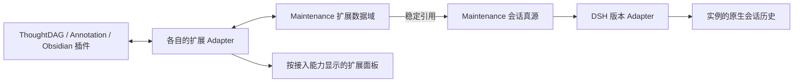

# Maintenance 可拔插插件数据：后续需求

日期：2026-09-10。状态：用户已批准实施；公共数据域、扩展 Adapter、宿主桥接和维护面板已实现。第三方插件业务入口改造与历史数据迁移独立实施。

## 目标

Maintenance 为其他插件产生的上下文对象、关系图和编辑状态提供可拔插适配。核心会话真源保留基本对话和执行语义；插件对象独立归属，通过稳定引用关联会话。统一存储和维护能力，不要求每个插件单独建立数据库。

## 数据归属

| 数据域 | 保存内容 | 真源与引用 |
|---|---|---|
| 原生/标准会话 | 消息、回答、工具执行、轮次、会话版本 | Maintenance 既有会话真源；平台原生目录是运行副本 |
| ThoughtDAG | 画布、节点、边、布局、材料、分支和合流关系 | 接管保存后由 Maintenance 管理图对象；引用一个或多个逻辑会话/消息，不把边伪造为会话历史或双亲会话版本 |
| Annotation / Sticker | 选区锚点、注释正文、颜色、贴纸、编辑状态 | 独立插件对象，引用会话、消息、段落或材料 |
| Obsidian 引用 | Vault、笔记、块标识、双链、摘录引用、同步状态 | Vault 仍是笔记正文真源；Maintenance 保存链接对象与同步记录 |

## 两类 Adapter

- **DSH 版本 Adapter**：处理平台会话格式和运行兼容，例如 RC1/RC2；不负责解释每个第三方插件完整业务对象。
- **插件扩展 Adapter**：处理自己的数据域、对象 schema、变更读取、写回、删除与恢复解释、面板和可选上下文供给。
- 两类注册、兼容性和启用状态独立。安装一个插件不意味着所有历史对象自动注入模型。

## 核心与扩展 Interface

核心提供带命名空间的稳定对象 ID、schema 版本、更新版本、删除标记和会话引用。对象引用使用逻辑会话/消息/锚点身份，避免依赖临时 runId 和目录名。一个对象允许引用多个会话。

扩展 Adapter 声明命名空间、支持的 schema/插件版本、读写和面板能力；负责自己的格式解析与迁移。核心不增加 ThoughtDAG 节点、Obsidian 块或贴纸颜色等专用字段。已有硬编码插件事件类型的迁移需另行设计，历史原生事件不能为了解耦而直接删除。

每个对象明确写入权。ThoughtDAG 浏览器编辑层与 Maintenance 接通后，需要修改其保存/加载/变更 Interface；不能仅扫描 DSH 日志就声称已保存画布。若采用浏览器缓存，它是待同步状态，不形成两个无规则的真源。更新携带预期版本，冲突保留双方内容和可见处理入口，不能静默覆盖。

## 加载与界面

- 启用并完成兼容性检查后，Maintenance 在扩展数据区域显示 ThoughtDAG、注释、知识链接等面板。
- DSH 当前实例配置相应插件时，才接通该实例的扩展读写、渲染和上下文能力；不同实例可以启用不同组合。
- 停用/卸载只停止能力加载，已经保存的对象保留。缺少 Adapter 时允许查看通用对象元数据和缺失能力提示；重新启用后恢复访问。
- 数据目录可分页和按需读取。面板出现不意味着全量对象正文加载进内存。
- 用户本轮选用哪些材料，由插件交互决定。不能因安装了插件而给每个会话自动塞入其全部内容。

## 空间与暂不实施项

本阶段不新增按请求保存完整上下文的机制，不按每轮复制画布、笔记或整份引用材料，不实现额外的上下文快照仓库。Interface 只预留未来的来源/版本引用能力，默认不产生这类备份。

插件对象的当前状态与实际编辑变更按需要保存。历史保留策略后续单独明确；不能把所有自动同步或渲染动作都记成无限增长的完整备份。既有会话正常记录继续保留。

暂时接受：外部材料修改或删除后，不保证完整还原当时模型所见的外部材料版本。未来若实施快照，需另行确定按需触发、去重、容量上限和清理规则。

## 后续实施与验收

优先以 ThoughtDAG 和 Annotation 两个实际不同的数据域验证公共 Interface，再接入 Obsidian 引用。验收覆盖：安装/启用/停用/重启，原生会话内容不因画布编辑改变，跨会话稳定引用，源对象编辑与冲突，删除/恢复，缺少 Adapter 的数据保留，超过一屏对象时的按需加载，以及没有逐轮整份材料备份。

ThoughtDAG 已按用户要求 fork 至 [linmu115/thoughtdag](https://github.com/linmu115/thoughtdag)，上游为 `chenxiachan/thoughtdag`。本轮不修改其会话发现逻辑，不部署该插件。
