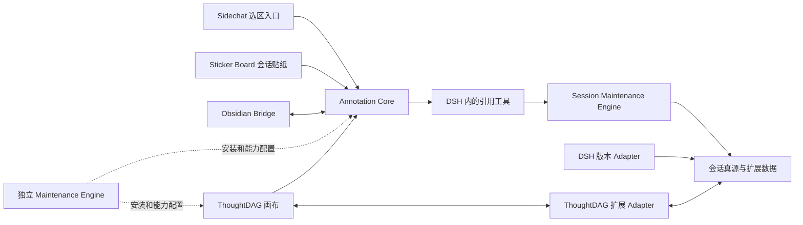

# 会话上下文关系图：插件、引擎改动清单

初稿：2026-09-10。需求修订：2026-09-14。交付更新：2026-09-15。会话主干图这一批修改已完成并安装到 DSH 0.1.5-rc.2 副本；精确版本、提交及验证范围见[联合发布报告](../../reports/2026-09-15-session-main-graph-release.md)。

产品行为和验收编号以[设计和功能需求](2026-09-10-session-context-graph-requirements.md)为准。本文保留职责、源码入口及实施顺序；实际完成状态以联合发布报告为准，不把历史建议或未确认精简项视作已执行。

2026-09-15 的“原生 Agent 主干与上下文管理”已形成独立代码与联合验证，见[补充规格](2026-09-15-native-agent-context-management.md)、[变更报告](../../changes/2026-09-15-native-context-management.md)和本文第 11 节；用户请求索引、模型写工具、窗口与真实释放属于这一批新变更，托管引擎排除在此阶段之外。

本次核查基线：Maintenance `42441ec`、ThoughtDAG `e2ce52b`、Sticker Board `b1ff2ea`、Annotation Core `7433774`。下文保留早期实施分工供追溯，本次变更重点为主干归属、右键交互、真实上下文边、蓝色来源标记、读取位置日志和 Adapter 联动。已取消全局网络及重答流程；额外功能取舍见[核查清单](2026-09-14-session-graph-feature-scope-audit.md)。

## 1. 先区分两个维护项目

| 项目 | 本需求中的职责 |
|---|---|
| `linmu115/dsh-session-maintenance` | 会话真源、版本与身份解析、扩展对象存储、后端引用查询、DSH 运行接入和维护面板；仓库自身包含 `apps/engine` |
| `dsh-maintenance-engine` 独立仓库 | Harness、profile、插件及知识层的安装、版本组合、部署和维护；不再建一套跨会话内容真源 |

因此，“Session Maintenance 引擎修改”主要指前者的 `apps/engine` 与 `packages/*`；后者只承担安装部署和兼容性接线。DSH Launcher 复用已建立的实例启动协议，跨会话引用不要求先改 Launcher。

## 2. 总体依赖关系

图中的“DSH 内的引用工具”是运行职责，不预设必须发布一个新 npm 插件。建议由 Annotation Core 的 host Module 注册通用读取工具，Session Maintenance 插件提供后端连接；协议与范围规则由后端统一定义。实施时若必须拆出独立包，再依据实际两方消费需求确定，不能每个前端各写一套。

## 3. 修改项目与功能矩阵

| 项目 | 改动必要性/阶段 | 要修改或增加的功能 | 保留的职责边界 |
|---|---|---|---|
| `dsh-annotation-core` | 必需，P1/P3 | 跨会话引用、目标草稿与提交、图自动创建事件、入向引用披露、撤销及工具返回位置回执 | 统一引用生命周期与预算；不把全部上游装入正文准备流程 |
| `dsh-sidechat` | 当前选区入口必需，P1 | 浮窗增加跨会话引用，调用共享目标选择和加入引用能力，导航后绑定正确输入框 | 保留现有侧聊/原生 fork；不让新会话贴纸默认变成隐藏侧聊 |
| `dsh-session-maintenance` 仓库 | 必需，P0/P1/P3 | 主干图/位置日志 DTO、幂等存储、固定范围、分页/预算、撤销操作、ThoughtDAG Adapter/schema/兼容清单及数据面板同步 | 会话真源与版本 Adapter 分工不变；删除全局网络面板，保留各数据域维护 |
| `dsh-session-sticker-board` | 必需，P2/P3 | 新建/挂接真实会话、来源高亮和蓝色跳转符号、目标主干建图、解除后标记同步、稳定消息锚点 | 普通贴纸红色符号保留，移除关系不删除真实会话或共享高亮 |
| `obsidian-deepharness-bridge` | 必需，P2 | 笔记侧创建/挂接会话、会话级回链、完整会话跳转、统一扩展归属迁移 | Vault 正文由 Obsidian 管理，不将笔记自动全文注入 |
| `linmu115/thoughtdag` | 必需，P3 | 每会话主干、空卡片/已有会话右键操作、有向上下文边、进入真实会话、来源预览、轻量位置日志、全局入口删除 | 不成为第二会话运行引擎，不存聊天副本，不成为独立跨会话引用的强依赖 |
| `dsh-maintenance-engine` 独立仓库 | 集成必要，分阶段 | 插件注册、能力依赖、schema 兼容与安装顺序、部署回执/回滚 | 管理安装包与实例接线，源会话仍归 Session Maintenance |
| `dsh-better-sidebar` | 条件修改 | 只有现有面板挂载能力不足时，补可选的贴纸/图面板挂载 Interface | 继续是容器，不存会话引用语义 |
| `dsh-session-context-menu` | 可选增强 | 会话列表提供“创建会话贴纸/挂接已有会话”等快捷入口 | 不是划选跨会话引用的前置依赖 |
| DSH 版本 Adapter（RC1 等） | 按能力差异修改 | 稳定完成位置、逻辑/原生会话映射、目标会话打开与只读历史映射 | 只解释平台差异，不保存画布或贴纸字段 |
| Launcher、官方 Harness 源码 | 首期无计划修改 | 复用持久原生空间和已有运行 Interface；缺口先评估官方扩展机制 | 不以改官方源码替代插件设计，不将跨实例启动混入本轮 |

## 4. Annotation Core 与 Sidechat 的具体修改

核查基线：Annotation Core `c0b01bd`；Sidechat `d42c76a`。这些是本地源码位置，不代表当前实例安装版本。

### 4.1 Annotation Core

| 已核查入口 | 建议改动 |
|---|---|
| `src/domain/model.ts`、`src/protocol/schema.ts`、`src/protocol/serialization.ts` | 新增跨会话上游引用；区别已有 `dsh-message` 普通选段和 `obsidian-note` 引用；对象修订/稳定截止身份进入公共协议 |
| `src/public/client-api.ts`、`src/public/host-api.ts` | 对外提供选择目标、创建/挂接引用、解析来源状态和提交的简洁 Interface |
| `src/client/source-registry.ts`、`src/host/source-registry.ts` | 注册会话引用源及其后端能力；避免把普通知识关联当作待展开上下文 |
| `src/client/reference-rail.tsx`、`src/client/reference-dialog.tsx` | 气泡识别新类型，展示来源和完成上限；已有详情保留，新会话贴纸主体走完整页跳转 |
| `src/client/composer-binding.tsx`、`src/client/native-adapter.tsx` | 目标页挂载后再添加，保留既有草稿，防止把异步操作提交到错误会话 |
| `src/host/submit-annotated.ts`、`src/host/session-reconcile.ts`、`src/host/commit-journal.ts` | 复用可靠提交和恢复，增加等待来源完成/登记及绑定目标实际轮次的处理 |
| `src/host/prepare-reference-set.ts`、`src/domain/budget.ts`、`src/host/pre-step.ts` | 新类型准备有界描述，不调用整份上游正文装配；初始选文也纳入预算 |
| `src/host/system-prompt.ts`、`src/index.ts` | 披露引用读取规则与工具，按实际能力启停，明确材料身份与用户指令的区别 |
| `src/remote/service.ts`、`src/remote/client.ts`、`src/remote/typert.ts` | 扩展目标目录、准备与引用状态通信，保持版本可识别 |

新增工具运行 Module 的文件名在实施时确定。单次与累计预算不能只放在客户端检查；真正返回模型结果之前由后端/运行层共同执行。

### 4.2 Sidechat

当前划选浮窗并不在 Annotation Core 本身：`src/client/annotate/overlay.tsx` 目前包含“添加到对话”和“在侧边聊天中提问”。

- `src/client/annotate/overlay.tsx`：增加“跨会话引用”按钮；调用共享选择流程，不把整个选择器业务固化在 Sidechat。
- `src/client/annotate/selection.ts`：传递来源回复身份和重点选段；字符范围只用于高亮。
- `src/client/annotate/producer.ts`：增加目标会话操作，来源快照在异步导航中保持稳定。
- `src/client/annotation-core-contract.ts`、`annotation-core-resolver.ts`：更新能力检查，旧 Core 不显示不可用新入口。
- `src/client/locales.ts`：补充名称、流式等待、来源失效和重试文案。

P1 可使用现有 Sidechat 浮窗作为接入点；将来如果提供独立 Annotation 选区入口，复用相同 Interface。不要为了新功能强制重写已有侧边聊天。

### 4.3 本次 Annotation 与图的执行协作

已存在的 `src/host/upstream-tools.ts`、`src/host/upstream.ts` 和 `src/host/system-prompt.ts` 提供 `dsh_upstream_read` / `dsh_upstream_search` 及初始来源问答。继续复用这些路径，补充实际返回范围的回执，不新建 ThoughtDAG 专用的全文读取工具。

- 创建跨会话引用或会话贴纸的 X → Y 关系时，通过统一后端操作确保 Y 的主干存在；引用、图关系及来源标记使用相同操作去重身份，失败留可恢复状态，不能依赖打开画布才导入。
- 节点进入真实会话时，按其目标身份准备合法入向引用，保留已有草稿/附件；后续轮次按当前已启用关系工作，开始会话不自动发送。
- 右键/键盘删除统一经过引用撤销接口；发送准备和工具返回前仍检查最新引用修订，不能绕过已有冲突检查。
- 初始上下文和读取/搜索产生稳定位置、实际返回区间及预算计数，按 Maintenance 合同写入图扩展日志。模型自述、普通来源预览、取消请求不冒充已交付给 AI 的内容。
- 源引用的固定截止位置与本轮分页位置分别表达。多父节点共同上游去重、并发预算和循环检查保持后端执行。

## 5. Session Maintenance 的具体修改

基线：`5fd467922dcc8ccda0f8d740fecd3811dc6ef2fb`。这里指 `linmu115/dsh-session-maintenance` 仓库。

| Module/已有目录 | 建议修改内容 |
|---|---|
| `packages/contracts/src` | 集中定义引用、固定范围、对象命名空间、分页结果、错误和预算回执 DTO；对外包复用该协议，不能复制平行定义 |
| `packages/session-domain` | 引用生命周期、完成位置和逻辑会话身份规则；图边不成为原生会话版本的额外父亲 |
| `packages/session-store` | 扩展对象与关系存储、索引和修订检查；复用既有版本与稳定 ID；按范围过滤读取和检索 |
| `packages/canonical-session-engine` | 解析固定历史范围、完成状态与来源版本，不修改源历史 |
| `apps/engine/src`、`apps/engine/src/http/routes.ts` | 组合引用查询 Module、共享预算、工作区/会话目录和扩展能力注册；提供可分页读取与范围内检索 |
| `plugins/dsh-session-maintenance/src` | 向 Annotation/运行工具提供 Engine 连接、实例和逻辑会话映射、能力状态；继续提交真实运行事件 |
| `packages/local-api-client` | 提供上述 Interface 的统一客户端和错误解释 |
| `packages/session-ui`、`apps/dashboard` | 按扩展接入显示 Annotation/ThoughtDAG/知识链接面板；首期先支持引用状态和缺失能力提示 |
| `packages/session-adapter-sdk`、`packages/adapter-dsh-rc1` 等 | 补充实际缺失的完成位置和只读定位能力；其余已支持能力复用 |

工作区选择器只需要目录元数据，不应把所有正文读进浏览器。正常打开历史会话仍由 DSH 读取已经准备好的原生文件。引用工具是对固定上游的专门查询，不能恢复成“每次打开会话都找 Adapter 补齐原生文件”的旧路径。

若真实会话已经完成但维护真源尚未登记该尾部，必须完成既有事件提交/flush 并等待可解析回执，再固化引用上限。查询必须基于稳定身份，不从 profile 路径推测逻辑会话 ID。

### 5.1 本次必须同步修改的 Maintenance 入口

| 当前源码入口 | 要修改的能力 | 对应需求 |
|---|---|---|
| `packages/contracts/src/session-graph.ts`、`session-context.ts`、`session-knowledge.ts` | 主干归属、空节点、关系状态、固定来源和披露位置回执、分页与容量 DTO；不在各插件复制平行合同 | GR10–GR14、LG01–LG10、AD01 |
| `apps/engine/src/extensions/adapters.ts` | ThoughtDAG schema/插件版本兼容、结构/引用/日志校验与旧图迁移；同步 Sticker 蓝色标记所需对象字段 | AD01–AD07 |
| `apps/engine/src/session-graph-service.ts` 及 `http/session-graph-routes.ts` | 按目标会话确保唯一主干、当前图范围加载、结构修订/删除记录、日志分页；不使用全局扫描拼图 | GR03、GR10–GR14、RM01–RM07 |
| `apps/engine/src/session-context-service.ts`、`session-context-reader.ts` | 固定范围读取、真实返回区间与继续位置、幂等回执；撤销后拒绝读取；回执写入与布局修订分离 | LG01–LG10、AC31、AC34–AC37 |
| `apps/engine/src/session-knowledge-service.ts` | 保留会话贴纸/笔记对象与共享目录；移除只服务全局影响/批量重答的分支，先核对其它消费者 | D09、AD03 |
| `plugins/dsh-session-maintenance/src/session-graph.ts`、`session-context.ts`、`session-knowledge.ts` | 作用域受控的主干/关系/回执接口与能力协商；复用工作区优先创建，不暴露 Engine 凭据 | GR08、AD01–AD04 |
| `packages/adapter-dsh-0-1-5/src/session-graph.ts`、`session-context.ts` | 已完成回复 ID、版本/截止事件、长回复分段位置解析；保留已修复的真实 message ID 路径 | CUT03、LG05、AD04 |
| `apps/dashboard/src/app.tsx`、`knowledge-network.tsx` 及现有扩展数据面板 | 移除全局网络/影响入口；在 ThoughtDAG Adapter 面板展示每个主干的结构、位置记录和维护状态 | AD03、AC38 |

结构写入、关系撤销和标记刷新使用统一操作身份与可恢复提交，不允许前端分别写三套互相冲突的记录。引用已撤销但图保存失败时，先以撤销状态阻止读取，再恢复图呈现；不为保住旧布局重新启用引用。

### 5.2 兼容与迁移必须先于部署

当前 ThoughtDAG `managedSchema: 1` 没有主干归属或披露日志字段。实现时明确升级合同/schema，不把新数据硬塞进旧校验器。当前 Adapter 已列出 ThoughtDAG 至 `0.4.14-rc2.5`；下一发布版本号在构建时确定，必须同时修改兼容清单和能力测试，不能仅更新插件版本造成“已安装但不兼容”。

旧图主干可唯一判定时核对后迁移；多目标图或旧知识线留待归属/拆分，不自动授予上下文权限，不删除测试以外的真实对象。日志不进入原生格式，也不为迁移增加会话/Vault 快照。部署顺序为共享合同与 Engine/Adapter → Maintenance 宿主 → Annotation/Sticker/ThoughtDAG 匹配消费者 → 合成组合验证 → 副本验收。

## 6. Sticker Board 与 Obsidian Bridge

核查基线：Sticker Board `bc45d92`；Bridge `56a55ec`。

### 6.1 Sticker Board

- `src/protocol.ts`：为会话贴纸增加可区分类型、目标逻辑会话和来源关系；普通贴纸 schema 迁移可识别。
- `src/client/sticker-store.ts`、`sticker-workspace.ts`：支持会话类型、复用对象和扩展存储接入，按需加载；现有通过 Bridge 读写贴纸的路径不能直接与新真源并行双写。
- `src/client/sticker-sidebar.tsx`、`src/client/index.tsx`：新建/挂接、完整页跳转、来源入口和类型呈现。
- `src/host/reference-delete-actions.ts`：明确删除对象、移除卡片和解除关联的不同范围；保留不删除会话的规则。

本次已核查 `src/client/overlay.tsx`、`index.tsx`、`knowledge-panel.tsx`、`knowledge.ts`、`styles.css`。会话贴纸需复用普通 Sticker Board 的来源高亮/定位机制，增加独立蓝色引用符号及目标跳转，不把普通贴纸的红色符号全部换色。`resolveSessionStickerAnchorId` 的稳定消息 ID 修复继续保留；高亮字符位置与上游截止位置各司其职。

`knowledge-panel.tsx` 保持“先选择工作区、实际创建前预检来源”的可靠流程，关系成功后调用共享主干建图能力并登记来源标记。刷新后重新按来源/目标/引用对象关联恢复蓝色入口。同一选区有多个目标时提供目标列表；解除一个连接只更新该关系的标记，不能把其它有效贴纸或高亮全部删除。

### 6.2 Obsidian Bridge

- `src/protocol.ts`：在现有贴纸/选段能力上增加会话目标和操作能力声明。
- `src/vault/references.ts`、`reference-source.ts`：支持笔记侧新建/挂接会话，以及将笔记内容明确选为上下文。
- `src/vault/native-backlink-index.ts`：复用笔记/块反向链接索引，保证关联与正文注入独立。
- `src/vault/sticker-backlinks.ts`、`sticker-backlink-lifecycle.ts`、`src/ui/sticker-backlink-display.ts`：会话贴纸链接可进入完整会话，解除单处链接不删除目标。
- 现有删除状态和待处理清理逻辑：增加新的对象类型解释及离线重试，避免升级后错误级联。

现状中，Bridge/Vault 保存部分贴纸、高亮和引用关系。切换到 Maintenance 扩展域时，应先建立旧 ID 到新对象 ID 的映射并逐项核对，再切换写入权。旧笔记中的用户正文和链接位置继续由 Vault 管理；回滚不得让两方再次独立改写同一对象。

## 7. ThoughtDAG fork 的修改范围

目标仓库：[linmu115/thoughtdag](https://github.com/linmu115/thoughtdag)。当前本地目录为 `D:/AI/DeepSeekHarness-Plugin/repositories/thoughtdag`，核查提交 `e2ce52b`，分支 `codex/rc2-maintenance-graph`。下面均是待实施变更。

| 当前源码入口 | 修改内容 |
|---|---|
| `src/maintenance/ManagedGraphApp.tsx` | 增加空白/节点/边右键菜单及键盘等效操作；会话主干选择；空卡片延迟绑定；工作区优先创建；在节点开始真实会话；来源预览弹层；删除常驻局部问答、全局网络入口和混杂的知识线提示 |
| `src/maintenance/model.ts` | 主干身份、空节点/待绑定边、权威关系与日志引用；替换 `connectKnowledge` 的装饰线语义；替换 `removePresentation` 删除路径，所有删除统一停用连接 |
| `src/maintenance/client.ts`、`dsh/lib/managed-graph.js` | 调用共享主干/关系/撤销/回执能力；目录与来源预览继续分页，客户端不能选择任意 run/profile 或自行拼上游 |
| `dsh/lib/client.js` | 节点打开/引用/会话贴纸与真实 DSH 页连接；保留草稿、蓝色符号跳转支持；移除全局准备重答入口对应动作 |
| `src/maintenance/KnowledgeNetwork.tsx` | 从 DSH 集成中移除全局目录图、入向/出向总览、影响查看及批量准备重答组件及专用调用 |
| `src/maintenance/managed.css` | 右键菜单、来源弹层、待绑定/解除/部分读取状态使用 DSH 风格，缩放/拖动/排版保留 |
| `dsh/MANAGED.md`、相关模型/宿主测试、`dsh/scripts/verify-ui.mjs` | 实现时同步更新使用说明和旧按钮/删除语义断言，覆盖从真实选区到主干、撤销、日志回读的流程 |

菜单添加与后端关系变更必须一起完成：现有拖线只建立知识关联、Delete/Backspace 只移除呈现，不能在只增加右键菜单后宣称已经实现上下文传导。非目标功能和未启用的上游独立应用范围见核查清单，不按名字批量删 `knowledge` 服务或 `SessionAtlas` 源码。

## 8. 安装部署与可拔插性

独立 `dsh-maintenance-engine` 核查基线 `fc09922`。已核查的相关入口为 `registry/plugins.yaml`、`src/plugin-compatibility.ts`、`src/plugin-deployment.ts`、`src/knowledge-deployment.ts`。

部署侧需要登记新能力与依赖版本，按 Core、消费者、扩展 Adapter 的顺序接入；执行 schema 兼容校验，提供安装回执和已有回滚能力。旧组合仍走现有功能，新入口仅在必需能力可用时启用。

禁用 ThoughtDAG 不应禁用 Annotation 跨会话引用；禁用 Obsidian 不应阻止会话之间引用；缺少 Annotation/后端查询能力时，保留图或卡片的通用元数据并显示缺失原因。不要在插件缺失时退化成全量历史复制。

## 9. 建议实施任务

| 任务 | 交付 | 对应验收 |
|---|---|---|
| W01 | 核对前置持久原生空间和最小扩展数据 Interface；固定各仓库基线 | AC02、AC18、AC19 |
| W02 | 公共引用 DTO、稳定完成位置、版本解析与只读范围查询 | AC05–AC07、AC21 |
| W03 | 后端读取/检索、长条目分页、单次和累计预算、循环防护 | AC08–AC12 |
| W04 | Annotation 新类型、工具披露、提交和恢复；Sidechat 工作区选择入口 | AC01、AC03、AC04、AC22 |
| W05 | 会话贴纸新建/挂接、完整会话打开、身份与删除规则 | AC13–AC15 |
| W06 | Obsidian 双向入口和旧对象迁移 | AC15–AC17 |
| W07 | ThoughtDAG fork 的节点、连线、存储和实例历史适配 | AC18、AC19、GR01–GR09 |
| W08 | 组合部署、禁用/恢复与空间增长验收 | AC17–AC22 |

### 本次修订的实施顺序

| 任务 | 交付 | 对应验收 |
|---|---|---|
| W09 | 主干/关系/轻量回执合同、存储和 Adapter/schema 兼容；旧图迁移边界 | AC26、AC27、AC39、AC40 |
| W10 | 统一创建/撤销、刷新不复活、并发读取复核和来源标记状态 | AC29–AC31 |
| W11 | Annotation/Sticker 自动确保目标主干，来源高亮与蓝色跳转符号 | AC26、AC28 |
| W12 | 右键空白/节点/边、占位节点、工作区创建、节点进入会话、来源预览；移除知识线/仅隐藏删除的旧行为 | AC23–AC25、AC30、AC32、AC33 |
| W13 | 初始上下文/工具返回位置日志、分页/去重/容量、关闭前端后的记录恢复 | AC34–AC37 |
| W14 | 删除 ThoughtDAG 与 Dashboard 全局网络、影响/重答专属入口；保留共享服务及域面板 | AC38 |
| W15 | 各仓库文档/回归与匹配版本构建，正式副本部署后用户验收 | AC01–AC40，重点 AD01–AD07 |
| W16 | Sticker 蓝标右键精确删除、Engine 源端身份核验与原子撤销、Core 本地撤销同步 | AC41、AC45 |
| W17 | RC2 工作区归档桥、Canonical 归档生命周期、Adapter 归档预览和恢复规则 | AC42、AC43 |
| W18 | Core 恢复权威已发送图引用的读取能力、ThoughtDAG 开始前复核与保留编辑 | AC44、AC45 |

W09 是写入新图结构的前置条件，W10/W11/W13 是宣称“连线可传导、删除可停用、图有日志”的前置条件。未确认的附加精简建议不混入实施必做项。

每个未来实现任务按所属仓库规则形成聚焦测试、Markdown 变更报告和提交。只在合成会话与受控测试目录验证；副本部署通过正式安装和生命周期 Interface。真实副本交互验收由用户执行，不代称通过。

本次文档检查只核对需求、文件入口、引用链接、差异范围与格式，不运行无关构建或真实会话测试。

## 10. 文档与变更范围

本次需求文档集中提交在 Session Maintenance 仓库，便于统一管理核心/扩展协议。其它插件的实施任务应引用本规格，在各自仓库维护自己的实现报告，不复制一份长期漂移的总规格。

当前开发根目录：`D:\AI\DeepSeekHarness-Plugin`。主要插件位于 `repositories`，独立部署引擎位于 `dsh-maintenance-engine`；本次文档工作区为 `worktrees/session-context-graph-20260913/dsh-session-maintenance`。早期 `repositories/.worktrees/session-context-graph-design` 只作为历史设计工作区保留。

最初需求确认阶段仅提交文档。2026-09-15 后续实施已包含蓝色标记删除、会话归档联动和已有图节点引用恢复（W16–W18）；实现、合成测试与副本部署分别记录，不把源码提交视为运行验收完成。

## 11. 原生 Agent 自主管理上下文

产品规则和验收为[补充规格](2026-09-15-native-agent-context-management.md)的 NC01–NC08、NCA01–NCA24。沿用已有目录和领域服务，不能把 Host-only 的任意图写入接口直接当成模型工具。

| 项目 / 已有入口 | 本阶段修改 | 验收重点 |
| --- | --- | --- |
| Maintenance `packages/contracts/src` | 统一请求索引、活动窗口、保留句柄、原生操作回执与能力协议；不在消费者复制合同 | NCA01–NCA06、NCA14、NCA24 |
| DSH 版本 Adapter `reader-presentation.ts`、`reader-storage.ts`、`session-context.ts` | 复用可信来源分类；请求/执行/回复稳定关联；原始材料到原生 surface 的身份解析；固定版本及截止核验 | NCA01–NCA05、NCA09 |
| Maintenance Engine `session-context-service.ts`、`session-graph-service.ts`、请求阅读查询及扩展 Adapter | 固定范围请求目录，窗口和保留记录，模型自身主干写入作用域，共享材料持有者，恢复和分页 | NCA05–NCA06、NCA11–NCA15、NCA18、NCA21–NCA22 |
| Maintenance 宿主插件 `session-context.ts`、`session-graph.ts` 及新的原生上下文执行模块 | 利用 DSH 原生 append/surface replacement 和 pre-step；来源核验、操作幂等与实际生效回执；Module 只负责运行编排，格式规则仍归版本 Adapter | NCA07–NCA09、NCA14、NCA17、NCA23–NCA24 |
| Annotation Core `reference-tools.ts`、`upstream-tools.ts`、`upstream-budget.ts`、`pre-step.ts`、公共 Host 合同 | 请求/图/状态工具，读工具按窗口定位，释放与暂停/恢复，保留标记、有限图编辑；原生工具规范和当前执行身份约束 | NCA06–NCA18、NCA24 |
| ThoughtDAG `src/maintenance`、`dsh/lib/managed-graph.js` | 请求目录入口，固定/活动/保留三层状态、暂停及释放结果；同步模型修改且保留用户布局 | NCA06、NCA10–NCA11、NCA15–NCA16、NCA18 |
| Sticker Board 现有引用标记与撤销订阅 | 复用统一解除事件；暂停/释放不被当成永久删除，解除才同步对应蓝标 | NCA10–NCA11 |
| Maintenance Dashboard 业务扩展目录与阅读器 | 请求索引与所属会话连接；按 Adapter/工作区/会话显示，窗口属于引用域，披露记录附属图 | NCA02、NCA18–NCA21 |
| Sidechat、Obsidian Bridge 及其它消费者 | 仅在共享协议/能力变更确需时适配；不各自复制窗口管理逻辑 | NCA10–NCA11、NCA20 |
| 原生 DSH 工具/会话公开扩展接口 | 优先复用 `defineTool`、`tools.register()`、`agent/pre-step`、`surfaceOp` 和 token meter；不预设 fork 官方引擎 | NCA07–NCA09、NCA17、NCA24 |
| 托管 Runtime / 托管工具导出 | 本阶段排除，不修改 Codex 托管引擎；新原生释放能力不得通过现有桥接误标为已支持 | NCA23 |

| 任务 | 顺序与交付 | 验收 |
| --- | --- | --- |
| W19 | 共享合同、请求索引与来源/版本/截止解析 | NCA01–NCA05 |
| W20 | 活动窗口、保留集合、预算、来源状态与操作恢复 | NCA06、NCA10、NCA14–NCA19 |
| W21 | 原生材料替代、下一请求前应用与实际占用核验 | NCA07–NCA09、NCA14、NCA17、NCA23 |
| W22 | 模型原生工具、自身主干写入、连接/解除与请求索引读取 | NCA10–NCA13、NCA24 |
| W23 | ThoughtDAG/Sticker/Adapter/看板联合更新及用户保留标记 | NCA11、NCA15–NCA16、NCA18–NCA22 |
| W24 | 合成原生组合验收、README/报告、匹配版本与副本发布 | NCA01–NCA24 |

W21 的通过标准是后续原生模型请求中实际不再包含被释放正文，同时原始会话保持可追溯。仅修改图状态或显示折叠不算实现。W19–W24 现已实现代码与对应合成验证，原生 AgentLoop 产生的替代事件通过完整 Engine 持久回执测试；各仓库变更报告记录具体范围，副本发布单独验证。
