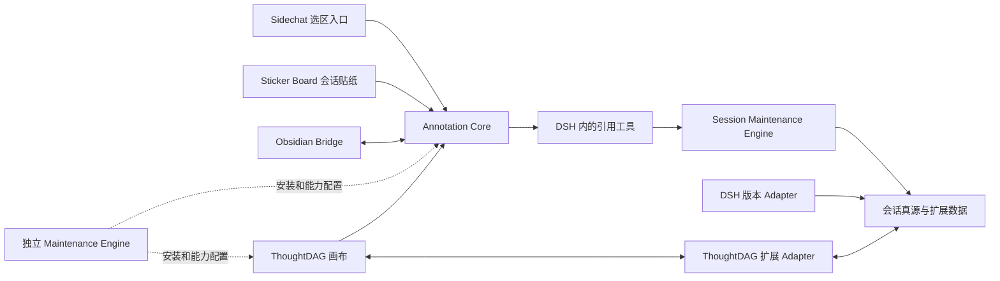

# 会话上下文关系图：插件、引擎改动清单

日期：2026-09-10。状态：用于拆分后续实施任务；本次只交付文档。

产品行为和验收编号以[设计和功能需求](2026-09-10-session-context-graph-requirements.md)为准。本文给出职责、已核查的代码入口、建议修改内容与交付顺序，不代表已经修改代码。

## 1. 先区分两个维护项目

| 项目 | 本需求中的职责 |
|---|---|
| `linmu115/dsh-session-maintenance` | 会话真源、版本与身份解析、扩展对象存储、后端引用查询、DSH 运行接入和维护面板；仓库自身包含 `apps/engine` |
| `dsh-maintenance-engine` 独立仓库 | Harness、profile、插件及知识层的安装、版本组合、部署和维护；不再建一套跨会话内容真源 |

因此，“Session Maintenance 引擎修改”主要指前者的 `apps/engine` 与 `packages/*`；后者只承担安装部署和兼容性接线。DSH Launcher 复用已建立的实例启动协议，跨会话引用不要求先改 Launcher。

## 2. 总体依赖关系

图中的“DSH 内的引用工具”是运行职责，不预设必须发布一个新 npm 插件。建议由 Annotation Core 的 host Module 注册通用读取工具，Session Maintenance 插件提供后端连接；协议与范围规则由后端统一定义。实施时若必须拆出独立包，再依据实际两方消费需求确定，不能每个前端各写一套。

## 3. 修改项目与功能矩阵

| 项目 | 改动必要性/阶段 | 要修改或增加的功能 | 保留的职责边界 |
|---|---|---|---|
| `dsh-annotation-core` | 必需，P1 | 跨会话引用类型、固定上限、目标草稿与提交、可复用选择器 Interface、工具披露与注册、引用生命周期 | 统一注释能力；普通引用继续工作，不把全部上游装入现有正文准备流程 |
| `dsh-sidechat` | 当前选区入口必需，P1 | 浮窗增加跨会话引用，调用共享目标选择和加入引用能力，导航后绑定正确输入框 | 保留现有侧聊/原生 fork；不让新会话贴纸默认变成隐藏侧聊 |
| `dsh-session-maintenance` 仓库 | 必需，P0/P1 | 引用身份、固定范围解析、分页和检索、全局预算、扩展对象/关系存储、插件能力和面板 | 会话真源与版本 Adapter 分工不变，格式知识不进入各插件 |
| `dsh-session-sticker-board` | 必需，P2 | 会话贴纸新类型、新建/挂接真实会话、完整页跳转、来源与子讨论关系、对象迁移 | 普通贴纸继续可用，删除入口不删除会话 |
| `obsidian-deepharness-bridge` | 必需，P2 | 笔记侧创建/挂接会话、会话级回链、完整会话跳转、统一扩展归属迁移 | Vault 正文由 Obsidian 管理，不将笔记自动全文注入 |
| `linmu115/thoughtdag` | 必需，P3 | 新节点呈现、三类边、统一存储接入、统一引用工具、实例会话发现适配 | 不成为第二会话运行引擎，不作为 P1 的强依赖 |
| `dsh-maintenance-engine` 独立仓库 | 集成必要，分阶段 | 插件注册、能力依赖、schema 兼容与安装顺序、部署回执/回滚 | 管理安装包与实例接线，源会话仍归 Session Maintenance |
| `dsh-better-sidebar` | 条件修改 | 只有现有面板挂载能力不足时，补可选的贴纸/图面板挂载 Interface | 继续是容器，不存会话引用语义 |
| `dsh-session-context-menu` | 可选增强 | 会话列表提供“创建会话贴纸/挂接已有会话”等快捷入口 | 不是划选跨会话引用的前置依赖 |
| DSH 版本 Adapter（RC1 等） | 按能力差异修改 | 稳定完成位置、逻辑/原生会话映射、目标会话打开与只读历史映射 | 只解释平台差异，不保存画布或贴纸字段 |
| Launcher、官方 Harness 源码 | 首期无计划修改 | 复用持久原生空间和已有运行 Interface；缺口先评估官方扩展机制 | 不以改官方源码替代插件设计，不将跨实例启动混入本轮 |

## 4. Annotation Core 与 Sidechat 的具体修改

核查基线：Annotation Core `c0b01bd`；Sidechat `d42c76a`。这些是本地源码位置，不代表当前实例安装版本。

### 4.1 Annotation Core

| 已核查入口 | 建议改动 |
|---|---|
| `src/domain/model.ts`、`src/protocol/schema.ts`、`src/protocol/serialization.ts` | 新增跨会话上游引用；区别已有 `dsh-message` 普通选段和 `obsidian-note` 引用；对象修订/稳定截止身份进入公共协议 |
| `src/public/client-api.ts`、`src/public/host-api.ts` | 对外提供选择目标、创建/挂接引用、解析来源状态和提交的简洁 Interface |
| `src/client/source-registry.ts`、`src/host/source-registry.ts` | 注册会话引用源及其后端能力；避免把普通知识关联当作待展开上下文 |
| `src/client/reference-rail.tsx`、`src/client/reference-dialog.tsx` | 气泡识别新类型，展示来源和完成上限；已有详情保留，新会话贴纸主体走完整页跳转 |
| `src/client/composer-binding.tsx`、`src/client/native-adapter.tsx` | 目标页挂载后再添加，保留既有草稿，防止把异步操作提交到错误会话 |
| `src/host/submit-annotated.ts`、`src/host/session-reconcile.ts`、`src/host/commit-journal.ts` | 复用可靠提交和恢复，增加等待来源完成/登记及绑定目标实际轮次的处理 |
| `src/host/prepare-reference-set.ts`、`src/domain/budget.ts`、`src/host/pre-step.ts` | 新类型准备有界描述，不调用整份上游正文装配；初始选文也纳入预算 |
| `src/host/system-prompt.ts`、`src/index.ts` | 披露引用读取规则与工具，按实际能力启停，明确材料身份与用户指令的区别 |
| `src/remote/service.ts`、`src/remote/client.ts`、`src/remote/typert.ts` | 扩展目标目录、准备与引用状态通信，保持版本可识别 |

新增工具运行 Module 的文件名在实施时确定。单次与累计预算不能只放在客户端检查；真正返回模型结果之前由后端/运行层共同执行。

### 4.2 Sidechat

当前划选浮窗并不在 Annotation Core 本身：`src/client/annotate/overlay.tsx` 目前包含“添加到对话”和“在侧边聊天中提问”。

- `src/client/annotate/overlay.tsx`：增加“跨会话引用”按钮；调用共享选择流程，不把整个选择器业务固化在 Sidechat。
- `src/client/annotate/selection.ts`：传递来源回复身份和重点选段；字符范围只用于高亮。
- `src/client/annotate/producer.ts`：增加目标会话操作，来源快照在异步导航中保持稳定。
- `src/client/annotation-core-contract.ts`、`annotation-core-resolver.ts`：更新能力检查，旧 Core 不显示不可用新入口。
- `src/client/locales.ts`：补充名称、流式等待、来源失效和重试文案。

P1 可使用现有 Sidechat 浮窗作为接入点；将来如果提供独立 Annotation 选区入口，复用相同 Interface。不要为了新功能强制重写已有侧边聊天。

## 5. Session Maintenance 的具体修改

基线：`5fd467922dcc8ccda0f8d740fecd3811dc6ef2fb`。这里指 `linmu115/dsh-session-maintenance` 仓库。

| Module/已有目录 | 建议修改内容 |
|---|---|
| `packages/contracts/src` | 集中定义引用、固定范围、对象命名空间、分页结果、错误和预算回执 DTO；对外包复用该协议，不能复制平行定义 |
| `packages/session-domain` | 引用生命周期、完成位置和逻辑会话身份规则；图边不成为原生会话版本的额外父亲 |
| `packages/session-store` | 扩展对象与关系存储、索引和修订检查；复用既有版本与稳定 ID；按范围过滤读取和检索 |
| `packages/canonical-session-engine` | 解析固定历史范围、完成状态与来源版本，不修改源历史 |
| `apps/engine/src`、`apps/engine/src/http/routes.ts` | 组合引用查询 Module、共享预算、工作区/会话目录和扩展能力注册；提供可分页读取与范围内检索 |
| `plugins/dsh-session-maintenance/src` | 向 Annotation/运行工具提供 Engine 连接、实例和逻辑会话映射、能力状态；继续提交真实运行事件 |
| `packages/local-api-client` | 提供上述 Interface 的统一客户端和错误解释 |
| `packages/session-ui`、`apps/dashboard` | 按扩展接入显示 Annotation/ThoughtDAG/知识链接面板；首期先支持引用状态和缺失能力提示 |
| `packages/session-adapter-sdk`、`packages/adapter-dsh-rc1` 等 | 补充实际缺失的完成位置和只读定位能力；其余已支持能力复用 |

工作区选择器只需要目录元数据，不应把所有正文读进浏览器。正常打开历史会话仍由 DSH 读取已经准备好的原生文件。引用工具是对固定上游的专门查询，不能恢复成“每次打开会话都找 Adapter 补齐原生文件”的旧路径。

若真实会话已经完成但维护真源尚未登记该尾部，必须完成既有事件提交/flush 并等待可解析回执，再固化引用上限。查询必须基于稳定身份，不从 profile 路径推测逻辑会话 ID。

## 6. Sticker Board 与 Obsidian Bridge

核查基线：Sticker Board `bc45d92`；Bridge `56a55ec`。

### 6.1 Sticker Board

- `src/protocol.ts`：为会话贴纸增加可区分类型、目标逻辑会话和来源关系；普通贴纸 schema 迁移可识别。
- `src/client/sticker-store.ts`、`sticker-workspace.ts`：支持会话类型、复用对象和扩展存储接入，按需加载；现有通过 Bridge 读写贴纸的路径不能直接与新真源并行双写。
- `src/client/sticker-sidebar.tsx`、`src/client/index.tsx`：新建/挂接、完整页跳转、来源入口和类型呈现。
- `src/host/reference-delete-actions.ts`：明确删除对象、移除卡片和解除关联的不同范围；保留不删除会话的规则。

### 6.2 Obsidian Bridge

- `src/protocol.ts`：在现有贴纸/选段能力上增加会话目标和操作能力声明。
- `src/vault/references.ts`、`reference-source.ts`：支持笔记侧新建/挂接会话，以及将笔记内容明确选为上下文。
- `src/vault/native-backlink-index.ts`：复用笔记/块反向链接索引，保证关联与正文注入独立。
- `src/vault/sticker-backlinks.ts`、`sticker-backlink-lifecycle.ts`、`src/ui/sticker-backlink-display.ts`：会话贴纸链接可进入完整会话，解除单处链接不删除目标。
- 现有删除状态和待处理清理逻辑：增加新的对象类型解释及离线重试，避免升级后错误级联。

现状中，Bridge/Vault 保存部分贴纸、高亮和引用关系。切换到 Maintenance 扩展域时，应先建立旧 ID 到新对象 ID 的映射并逐项核对，再切换写入权。旧笔记中的用户正文和链接位置继续由 Vault 管理；回滚不得让两方再次独立改写同一对象。

## 7. ThoughtDAG fork 的修改范围

目标仓库：[linmu115/thoughtdag](https://github.com/linmu115/thoughtdag)。本轮没有新建本地克隆，也没有把上游文件名视为已确定实施入口；正式开工先固定 fork 的基线提交。

1. **节点类型和打开动作**：增加会话贴纸/真实会话入口，点击进入 DSH 完整会话；展开节点才按需获取局部回复。
2. **会话身份**：引用逻辑 ID，并通过当前实例映射到原生会话；不同画布复用同一身份。
3. **发现与读取**：通过受支持的 DSH/Session Maintenance Interface 获取历史，遵守持久原生目录配置。
4. **上下文连线**：区分分支来源、可用上游引用和普通知识关联；复用对应领域的关系 ID 与创建/解除接口，画布只保存呈现状态。移除线条呈现和解除关系分别处理，不能共用“连上线就全文注入”的行为。
5. **执行接入**：使用目标 DSH Agent 进行真实轮次执行；接入 Annotation 统一引用披露和读取工具，不独立拼接所有上游。
6. **保存与同步**：改造画布加载/保存/变更 Interface，由扩展 Adapter 保存图对象与修订；不能仅扫描聊天日志推断完整布局。
7. **错误与恢复**：来源缺失、引用失效、插件停用、schema 不兼容有明确状态；恢复插件后读取已保存数据。
8. **后续网络**：预留跨画布统一引用，不在初次适配时实现全局自动推演或递归重放。

## 8. 安装部署与可拔插性

独立 `dsh-maintenance-engine` 核查基线 `fc09922`。已核查的相关入口为 `registry/plugins.yaml`、`src/plugin-compatibility.ts`、`src/plugin-deployment.ts`、`src/knowledge-deployment.ts`。

部署侧需要登记新能力与依赖版本，按 Core、消费者、扩展 Adapter 的顺序接入；执行 schema 兼容校验，提供安装回执和已有回滚能力。旧组合仍走现有功能，新入口仅在必需能力可用时启用。

禁用 ThoughtDAG 不应禁用 Annotation 跨会话引用；禁用 Obsidian 不应阻止会话之间引用；缺少 Annotation/后端查询能力时，保留图或卡片的通用元数据并显示缺失原因。不要在插件缺失时退化成全量历史复制。

## 9. 建议实施任务

| 任务 | 交付 | 对应验收 |
|---|---|---|
| W01 | 核对前置持久原生空间和最小扩展数据 Interface；固定各仓库基线 | AC02、AC18、AC19 |
| W02 | 公共引用 DTO、稳定完成位置、版本解析与只读范围查询 | AC05–AC07、AC21 |
| W03 | 后端读取/检索、长条目分页、单次和累计预算、循环防护 | AC08–AC12 |
| W04 | Annotation 新类型、工具披露、提交和恢复；Sidechat 工作区选择入口 | AC01、AC03、AC04、AC22 |
| W05 | 会话贴纸新建/挂接、完整会话打开、身份与删除规则 | AC13–AC15 |
| W06 | Obsidian 双向入口和旧对象迁移 | AC15–AC17 |
| W07 | ThoughtDAG fork 的节点、连线、存储和实例历史适配 | AC18、AC19、GR01–GR09 |
| W08 | 组合部署、禁用/恢复与空间增长验收 | AC17–AC22 |

每个未来实现任务按所属仓库规则形成聚焦测试、Markdown 变更报告和提交。只在合成会话与受控测试目录验证；副本部署通过正式安装和生命周期 Interface。真实副本交互验收由用户执行，不代称通过。

本次文档检查只核对需求、文件入口、引用链接、差异范围与格式，不运行无关构建或真实会话测试。

## 10. 文档与变更范围

本次需求文档集中提交在 Session Maintenance 仓库，便于统一管理核心/扩展协议。其它插件的实施任务应引用本规格，在各自仓库维护自己的实现报告，不复制一份长期漂移的总规格。

当前开发根目录：`D:\AI\DeepSeekHarness-Plugin`。主要插件位于 `repositories`，独立部署引擎位于 `dsh-maintenance-engine`；本次文档工作区为 `repositories/.worktrees/session-context-graph-design`。

本轮不修改任何插件源码、运行配置、安装包或真实会话数据；没有把文档提交视为功能完成。
