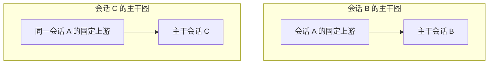

# 会话贴纸、跨会话引用与上下文关系图：设计和功能需求

初稿：2026-09-10。修订：2026-09-14。状态：本次会话主干图、右键操作、蓝色引用标记、删除语义和轻量读取记录已由用户确认；本次只更新文档，尚未实现本次修订。

文档基线：Session Maintenance 提交 `5fd467922dcc8ccda0f8d740fecd3811dc6ef2fb`。该基线已包含 `fd6db7a` 的持久原生会话空间实现提交；本次没有核验副本部署或代替用户验收。可拔插扩展数据仍作为前置能力，需要实施时单独确认完成程度。

初稿基线仅供追溯。本次源码核查基线为 Maintenance `42441ec`、ThoughtDAG `e2ce52b`、Sticker Board `b1ff2ea`、Annotation Core `7433774`。以下修订取代此前关于全局维护网络、仅删除呈现和画布知识线的产品要求；旧实现报告仍作为历史记录，不表示新要求已完成。

关联文档：

- [持久原生会话空间](2026-09-10-persistent-native-session-space.md)
- [可拔插扩展数据](2026-09-10-pluggable-extension-data-requirements.md)
- [插件、引擎改动清单与实施顺序](2026-09-10-session-context-graph-plugin-changes.md)
- [现有 DAG 功能取舍核查](2026-09-14-session-graph-feature-scope-audit.md)

## 1. 产品目标与已确定的方向

用户在阅读会话或 Obsidian 笔记时，通过选区、引用和会话贴纸持续展开讨论。每个独立讨论仍是可以进入完整会话页、继续调用 DSH 工具的真实会话。画布维护有方向的上下文传导关系、固定来源位置和实际披露记录；真实问答在会话页进行。

沿用 ThoughtDAG 的交互和上下文组织思想，不要求照搬其代码结构。用户可以从一条“河流”的某个位置引出支流，再把支流接入另一条会话；引用提供的是有固定上限、可以按需读取的上游范围。

以下决定以本轮讨论中最后的修正为准：

| 编号 | 已确定的需求 |
|---|---|
| D01 | 新增“会话贴纸”类型，绑定真实独立会话；点击主体进入完整会话页 |
| D02 | Annotation 提供跨会话引用能力：选段 → 跨会话引用 → 工作区 → 会话 → 跳转目标会话 → 输入框引用气泡 |
| D03 | 引用范围包括来源会话开头至被引用 AI 回复完整结束；选区只标记重点，不按字符位置截断上游 |
| D04 | 来源回复结束后固定上限，来源后续轮次不自动流入既有引用 |
| D05 | 发送时先提供被引用回复所在问答轮次，较早上游通过后端工具按需读取；默认不把完整历史直接拼进目标提示词 |
| D06 | 会话与 Obsidian 笔记可以双向关联和跳转，笔记侧也能成为创建或挂接会话的入口 |
| D07 | 会话真源、扩展对象和 Vault 正文分开归属；插件按实例配置接入，停用保留已存对象 |
| D08 | 默认不新增逐轮上下文快照、不为每个引用复制整份会话或笔记、不强制预生成完整上游摘要 |
| D09 | 删除全局会话思维图、全局维护网络、跨画布影响查看和批量准备重答；这些能力不再列入后续阶段 |
| D10 | 每个会话拥有自己的主干图，按用户手动创建、会话贴纸或跨会话引用动作按需生成；不为全部历史会话批量建图 |
| D11 | X 选段创建会话贴纸 Y，或 X 的内容引用到 Y，均为 X → Y，图归执行会话 Y；X 是 Y 的上游 |
| D12 | 对象添加、连接、移除和进入会话以右键菜单为主要入口；空卡片在用户开始会话前只是占位对象 |
| D13 | 移除边或卡片对应的连接会停止这些连接后续传递上下文，刷新后不得由旧记录重新导入 |
| D14 | 会话贴纸在来源选文上显示高亮和蓝色引用符号，点击符号进入目标会话；普通贴纸的红色符号保留 |
| D15 | 取消“局部问答”名称和常驻区域；右键“查看来源”提供必要的只读预览、选文和引用操作 |
| D16 | 图维护轻量的固定上限与披露位置日志；后端记录实际返回范围，图不保存全文副本，Maintenance 扩展 Adapter 同步适配 |

本文中的工具名称、数据字段名称、分期和异常处理细节是建议设计。固定范围、按需工具读取、数据归属和空间约束是必须满足的需求；具体预算数值等未决项见第 12 节。

## 2. 用户看到的对象和关系

### 2.1 对象

| 对象 | 含义与行为 |
|---|---|
| 原生会话 | 在 DSH Agent 环境中工作的真实会话，有自己的会话身份和后续历史 |
| 普通贴纸 | 现有批注、摘录、想法等对象，继续保留现有能力 |
| 会话贴纸 | 指向一个真实会话的卡片入口；可以新建会话后绑定，也可以绑定已有会话 |
| 空卡片 | 尚未绑定真实会话的画布占位对象；可以命名、移动、连接和删除，不自动创建原生历史 |
| 上游引用 | 来源会话、固定完成位置、重点选段、目标会话及目标提交之间的关系 |
| 笔记引用 | 指向 Vault、笔记、标题或块的链接；正文仍由 Obsidian 管理 |
| 画布节点 | 对会话、贴纸、材料或笔记引用的呈现；布局对象不复制被呈现的正文 |

同一个会话可以出现在自己的主干图、其它会话的上游位置、多个贴纸和多个笔记入口中。这些入口指向相同逻辑会话 ID，不因多次展示新建会话副本。一个贴纸对象可以有多个呈现位置；多张独立贴纸也允许指向同一会话。其它会话引用了 X，不会让这些下游会话自动出现在 X 自己的图里。

本需求中的“工作区”是 DSH/Session Maintenance 会话目录提供的项目或会话分组，不是 Git worktree，也不通过扫描任意目录推测会话归属。实例/profile 是运行归属，工作区是用户选择目标会话时的分组。

### 2.2 上下文关系与笔记导航

| 关系 | 表达内容 | 对模型输入的作用 |
|---|---|---|
| 分支来源 | B 从 A 的某条回复展开 | 保存来源；按关联的上游引用提供读取范围 |
| 上下文引用 | Y 本轮可以查询 X 的指定上游 | 首先带入被引用问答轮次；较早上游按需通过工具读取 |
| 知识关联 | 会话与笔记、会话与会话彼此有关 | 默认提供导航，不自动加载正文 |

分支来源是上下文引用的创建来源标签，多来源汇入同一讨论形成上下文 DAG；树是展示方式，不限制多来源引用。新版画布中的活动箭头统一表示上下文传递，不再把不传递上下文的“知识关联线”混在其中。Obsidian 双向关联仍保留在笔记关联入口；导航本身不授权读正文。

会话粒度上可能出现 X 引用 Y、Y 又引用 X。上下文依赖必须落在各自的固定历史位置上，不能把双方“最新全部内容”递归展开。校验依赖时使用具体引用/版本/完成位置，不能仅凭两个会话 ID 相同或相互连线就判断全部关系无效。

两处 A 复用同一真实会话，具体引用可以固定到不同回复。A 自己的主干图只管理 A 的上下文来源，不因这两个引用自动列出 B、C。

## 3. 功能需求：跨会话引用

### 3.1 主流程

| 编号 | 要求 |
|---|---|
| XR01 | 在 AI 回复中选中文字时，浮窗新增“跨会话引用”，保留现有划选入口 |
| XR02 | 点击后先显示工作区列表；支持鼠标滚轮，列表过长时分页或虚拟显示，不阻塞整个页面 |
| XR03 | 点击工作区后展开该分组下的会话；展示足够区分目标的标题/位置，按需加载目录元数据 |
| XR04 | 会话目录不依赖原有 200 条正文预载限制；冷历史只要属于可用会话空间，也应可发现和选择 |
| XR05 | 点击目标会话 Y 后进入 Y 的完整会话页，确保 Y 的输入框绑定完成，再添加引用气泡 |
| XR06 | 气泡显示来源、选段和“包含截至该回复完成的上游”；用户可以添加问题、编辑注解或移除待发送引用 |
| XR07 | 选择目标不自动发送、不自动启动 AI；正式发送由目标会话的正常提交动作触发 |
| XR08 | 保留目标输入框已有文字、附件和引用；同一操作重复点击、网络重试不重复创建引用 |
| XR09 | 导航或挂载失败时保留本次选区意图，显示可重试状态；不能误加到当前其它会话 |
| XR10 | 发送失败后，问题和待发送引用可恢复；发送成功后，关系绑定目标实际用户轮次 |
| XR11 | 创建引用意图后按目标 Y 确保主干图存在，并写入 X → Y 的待发送关系；发送成功后转为可读关系，重试不重复建图或边 |
| XR12 | 取消待发送引用时撤销对应待发送边；已发送关系的停用通过统一关系操作完成，不能将删除草稿误作抹除历史 |

首期目标选择范围为当前实例已接通、可以正常打开的会话空间。跨运行实例自动启动、接管或迁移会话是后续范围；选择器不能为打开目标而偷偷复制会话到另一个实例。

工作区和会话搜索可作为增强功能，不替代用户确定的“先工作区、再会话”的基本浏览路径。返回上级时保留列表位置。

### 3.2 截止范围

| 编号 | 要求 |
|---|---|
| CUT01 | 例：选中第 12 轮 AI 回答中部，范围包括会话开头至第 12 轮完整回答，也包括该回答中选段之后的文字 |
| CUT02 | 第 13 轮及其后的消息、工具结果和由其提炼的信息不在范围内 |
| CUT03 | 记录稳定的回复/完成事件/轮次身份；不以屏幕位置、当前数组序号、临时 runId 或字符偏移定义历史上限 |
| CUT04 | 选段仍保存为重点材料；选区锚点可复用原有 Annotation 能力，但不用于上游历史截断 |
| CUT05 | 来源继续追加历史后，已发送引用保持原上限；更新为较新的上游必须建立明确的新引用修订 |
| CUT06 | 来源重写、重生成、删除、版本被清理时，不静默指向另一个“看起来相似”的回复 |

建议流式状态规则：选中仍在生成的回复时可建立待完成引用，等该回复成功结束并获得稳定身份后才能作为完整上游提交。若原回复失败或被取消，显示未完成状态；不能把重试生成的另一条回复自动当成原引用。具体禁用发送还是暂存等待由实施交互设计确定，但必须满足“上限固定后才可读取”。

回复已完成而 Maintenance 尚未完成版本登记时，先等待对应登记回执，不以不稳定的索引或另一版本替代。普通工作区浏览不因此触发旧历史的全量补投影。

## 4. 功能需求：会话贴纸

| 编号 | 要求 |
|---|---|
| ST01 | 在普通贴纸之外增加会话类型，真实会话 ID 是目标身份，不把贴纸正文伪装成会话 |
| ST02 | 支持从选区创建独立讨论，也支持挂接已有会话；二者在操作上可区分 |
| ST03 | 点击贴纸主体进入完整会话页；可另设来源/详情动作，不能只打开注释详情框 |
| ST04 | 从会话贴纸进入的会话能正常使用目标 DSH Agent 的工具、模型、项目和权限配置 |
| ST05 | 来源会话的工具权限和项目配置不因为一次内容引用而覆盖目标配置 |
| ST06 | 新讨论可继续通过引用或选区生成子讨论，并保留分支来源关系 |
| ST07 | 多处展示同一会话不会产生多份原生历史；重启后仍能解析相同会话身份 |
| ST08 | 删除一个卡片位置、解除一个引用、删除贴纸对象、删除真实会话是不同操作 |
| ST09 | 关闭画布或移除入口不会关闭、归档或删除其目标会话 |
| ST10 | 从 X 选段新建或挂接 Y 后，创建或更新 Y 的主干图及 X → Y 引用；在 Y 的真实会话页继续讨论 |
| ST11 | 来源 X 中被引用选文显示高亮，并在对应位置显示蓝色引用符号；普通贴纸的红色符号与既有高亮配色保留，蓝色针对引用符号，不强制把正文高亮改成蓝色 |
| ST12 | 点击蓝色符号直接进入目标 Y 的完整会话页，不只打开详情、不自动发送；同一位置指向多个会话时列出目标供选择，不任意跳转 |
| ST13 | 蓝色符号、选区和目标以稳定对象/会话/消息身份保存；刷新、重启和再次打开来源后恢复，不把页面展示节点编号当作原生消息 ID |
| ST14 | 来源预检、工作区选择、创建会话和绑定引用可恢复且幂等；绑定成功才显示有效蓝色符号，失败不留下虚假引用标记 |
| ST15 | 解除该会话贴纸的上下文关系后，来源标记刷新为相应解除状态或移除该活动入口；保留同处其它有效引用的符号/高亮，不删除源正文、目标会话或普通红色贴纸 |

“继承上游”在本设计中表示新讨论可读取该固定上游范围。推荐新建真实会话并挂接上游引用，以按需工具读取实现；不要求把全部原文预填入新会话提示词。

已有 Sidechat 的原生 fork 保留自己的完整历史继承语义。会话贴纸创建不得直接复用其“默认归档隐藏、只在侧栏继续”的行为。若以后增加“原生完整 fork”选项，应单独标示，并核对其原生历史与引用材料是否重复；两种实现不能无说明地互换。

## 5. 功能需求：Obsidian 与画布

### 5.1 Obsidian 双向入口

| 编号 | 要求 |
|---|---|
| OB01 | 会话或会话内选段可以关联 Vault 的笔记、标题或块 |
| OB02 | 笔记侧可以选段创建会话贴纸、挂接已有会话、打开目标会话 |
| OB03 | 会话侧能回到来源笔记，笔记侧能打开目标完整会话并按需定位回复 |
| OB04 | 笔记移动或重命名后，使用现有 Vault/块身份能力继续解析；无法唯一定位时显示异常 |
| OB05 | “建立关联”和“选作模型材料”分别表达；双链本身不将整个笔记或所有关联会话送进模型 |
| OB06 | 解除某处双链只解除该链接；不删除其它笔记的链接、目标会话或笔记正文 |

复用现有 Obsidian Bridge 的协议跳转和原生反向链接能力。Vault 继续保存笔记正文；不为实现上下文图而复制整座 Vault。对笔记修改后当时正文能否还原，沿用已有“不新增完整快照”的约束。

### 5.2 每个会话自己的主干图

| 编号 | 要求 |
|---|---|
| GR01 | 画布展示真实会话节点、会话贴纸入口和未绑定空卡片；活动箭头从上下文来源指向接收会话，只表达上下文传递 |
| GR02 | 节点默认只显示标题、身份/状态和必要来源说明；右键“查看来源”按需预览，不常驻展开历史问答 |
| GR03 | 手动创建、跨会话引用或会话贴纸动作确保目标主干图存在；用户不必先打开画布，重复操作复用同一图 |
| GR04 | 会话的多来源合流通过多个引用表达，不伪造双亲原生会话版本或重写原始问答 |
| GR05 | 画布控制可用上下文来源；AI 通过统一工具读取，画布中存在一条边不代表模型已读完整来源 |
| GR06 | “移除边”和“移除卡片”包含停用受影响连接，不再只是删除呈现；既有目标历史保留，刷新后使用最新关系状态 |
| GR07 | 布局、节点呈现和编辑状态通过 ThoughtDAG 扩展 Adapter 保存；浏览器缓存不能成为无规则的第二真源 |
| GR08 | 历史会话发现和打开遵守 DSH 当前实例的持久化配置，不写死 `$DSH_HOME/sessions` |
| GR09 | ThoughtDAG 停用时，Annotation 跨会话引用和后端读取仍可独立工作 |
| GR10 | 主干身份由目标逻辑会话 ID 确定；按当前实例接入范围定位图，同一会话不得因刷新、重复引用或再次进入而产生多个默认主干 |
| GR11 | 图只加载当前主干和用户明确加入或追溯的来源；不能扫描所有会话并自动聚合整个关系网络 |
| GR12 | X 作为 Y 的支流只在 Y 的图中显示该关系，不把 Y 自动加进 X 的图；手动加入节点也不隐式导入它的全部入向和出向关系 |
| GR13 | 从任一已绑定节点选择“在此节点开始会话”，进入对应真实会话；其可用入向引用按固定范围披露，不另起画布 Agent |
| GR14 | 图中的固定上限和工具返回位置日志通过后端写入同一扩展域，前端未打开时也能记录；加载日志分页且不加载聊天正文 |

手动新建的空图可以暂未绑定主干；首次确定执行会话时绑定其逻辑身份，若该会话已有主干则复用，保留未合入的布局草稿并提示，不静默覆盖。自动建图必须已知目标会话身份。仅打开普通会话或列出工作区不能为所有会话创建空图。

### 5.3 右键菜单与开始会话

| 对象 | 菜单与行为 |
|---|---|
| 画布空白 | 添加空卡片；添加已有会话（工作区 → 会话）；按来源排列；适合画布 |
| 未绑定空卡片 | 重命名；连接到节点；在此节点开始会话；移除卡片。开始会话时先选工作区，再明确创建并绑定真实会话 |
| 已绑定会话/会话贴纸卡片 | 在此节点开始会话（继续已有会话）；查看来源；添加/管理上游连接；移除卡片 |
| 有向边 | 查看固定来源与读取位置；移除边 |

菜单在点击位置打开，遵守 DSH 字体、色彩、圆角、间距和弹层风格；靠近视口边缘时自动调整，超长目标列表可滚动，Escape/点击外部关闭。触屏或键盘可通过对象的“更多操作”访问相同命令。右键不得误触打开会话、创建卡片或发送消息。

仅添加已有会话卡片不会自动建立上下文。拖动连接点和右键连接使用同一领域命令：先确定来源与接收方，再选择或明确确认来源的已完成回复并固定上限。当前选文带来的回复可直接复用；无已完成回复的空节点只能保存待绑定连接，不能宣称上游可读。连线不运行模型。

开始会话时，只为节点对应的目标会话准备该节点已确认的入向引用；保留目标正文、附件和其它合法引用，首次发送前仍由用户检查并发送。来源后续追加不刷新既有上限，已经解除的连接不得通过重新进入会话再次附加。选择的节点不是当前主干时，进入该节点的真实会话，并创建或复用它自己的主干图；不改变原图的主干身份，不把别的图中无关的关系全部并入。

“局部问答”的常驻栏和名称删除。右键“查看来源”是只读按需弹层，保留固定回复、分页、选文引用和创建会话贴纸能力；它不提供另一套聊天输入或执行功能。独立材料卡等额外入口的取舍以功能核查文档的建议状态为准，不把未确认建议视作已删除需求。

### 5.4 移除、撤销和刷新

| 编号 | 要求 |
|---|---|
| RM01 | 移除边必须通过领域接口撤销对应的可读关系并保存图变更；移除卡片同时处理其受影响连接，未绑定卡片只移除自身及待绑定连接 |
| RM02 | 右键、Delete/Backspace、工具栏和其它删除入口使用同一命令；不留一条只隐藏线条、却继续传递上下文的删除路径 |
| RM03 | 操作成功后立即刷新当前图；下一次刷新、重启或导入关系时依据最新状态，已撤销的边不被恢复。删除记号/修订需持久保存 |
| RM04 | 删除只作用于明确选中的关系身份。其它图中的独立引用不受影响；同一权威引用的其它呈现必须反映解除状态，不能一边显示有效、一边失效 |
| RM05 | 并发编辑、正在读取或失败重试时保留可解释状态；撤销成功后新的读取被拒绝，旧请求返回前重新校验。不能先显示成功再静默保留可读关系 |
| RM06 | 已进入目标历史的文字和既有回答不会被追溯擦除；停止传递的含义是以后不能通过被解除的关系再读取，不承诺模型忘记已见内容 |
| RM07 | 移动、排版、缩放和关闭画布不撤销引用。真实会话、笔记、贴纸对象的删除仍是单独操作，不因删卡片级联执行 |

移除中间节点只解除明确关联的连接，不把其父子节点自动重连，也不扩大剩余引用的截止范围。来源符号和其它关联呈现依据权威状态更新，共享高亮按仍存关系保留。只移除整张画布的旧入口必须在实施时改名为明确的图管理动作，不能与“删除卡片/边”的语义混用；此修订不授权批量删除已有图或真实数据。

### 5.5 删除全局产品入口

删除 ThoughtDAG 的全局维护网络、全部会话总图、跨画布影响查看和批量准备重答；Maintenance Dashboard 中对应的全局入口一并删除，不能只把按钮从一个前端挪到另一个前端。其专用前端状态、查询/重答调度和独立扫描任务从本地 DSH 集成中退出。

保留单会话主干图所需的目录、引用索引、对象存储、单个来源状态检查，以及 Maintenance 各扩展 Adapter 的对象/删除/冲突管理面板。普通工作区查找已有会话仍然存在。共享服务不因带有“knowledge”或“network”名字而整体删除。上游独立应用中未被 DSH 入口加载的能力不在本轮批量删源码范围。

### 5.6 轻量存储边界

图以结构化信息为主：主干身份、节点/边、稳定来源引用、固定截止位置、布局、状态和读取位置记录。来源选区可保存必要的短摘录及定位信息；问答正文、工具输出和 Vault 正文按需从各自真源读取，不放入图对象。

图结构与读取记录分别分页和更新。AI 每读取一次不应重存整张图、制造布局修订冲突或产生整图快照。插件关闭/恢复与结构迁移必须遵守同一容量和兼容规则。

## 6. 后端工具与上下文容量

### 6.1 AI 的使用流程

目标提交携带用户问题、重点选文、有界的来源说明、引用 ID，以及被引用回复所在问答轮次。该轮从来源问题开始，按时间顺序读取到被引用的已完成回复，包括选中文段之后、该回复结束之前的内容；该回复之后的内容一律排除。完整上游保留在会话真源中，较早轮次通过工具按需获取；不得将“已建立引用”解释为“已读取全部上游”。

2026-09-14 用户补充：不能默认只提供孤立选文。首轮材料超过额度时须明确标记未完整展开，并提供继续该轮的游标；该轮完整后再以游标读取更早上游。用户提交引用已经授权这类只读访问，AI 应按回答需要自行调用，无需再次要求用户批准读取。笔记文档列表为空不等于跨会话上下文为空。初始材料和后续工具结果共同受本轮额度控制；不建立额外全量会话快照。

建议首期工具 Interface：

| 工具 | 输入要点 | 返回与约束 |
|---|---|---|
| `read_reference` | `referenceId`、可选游标、可选轮次数/返回预算 | 首次从引用截止位置附近开始；返回轮次或内容分段、稳定来源定位、是否还有内容及下一游标 |
| `search_reference` | `referenceId`、查询、可选游标/返回预算 | 只检索固定上游，返回有界命中片段和可交给读取工具的位置 |

名称和参数是草案，不代表现有工具已经实现。公开 Interface 保持简洁，截止解析、版本映射、目录读取、预算和缓存放在后端 Module 内；前端、ThoughtDAG 和 Obsidian 复用同一语义。

### 6.2 必须满足的读取规则

| 编号 | 要求 |
|---|---|
| RD01 | 后端按引用 ID 解析来源、目标和固定上限；不能由 AI 任意增大上限 |
| RD02 | 读取、搜索、目录摘要、派生缓存均受相同上限约束；不得从最新全会话摘要泄漏后续轮次的信息 |
| RD03 | 只有本实例接通的能力和当前目标会话关联的引用可被该工具使用；引用不扩大目标 Agent 的运行权限 |
| RD04 | 支持长单条回复的继续读取，不能只按轮次分页后永远无法读到被截掉的后半段 |
| RD05 | 单次返回限制覆盖普通问答、工具参数、工具输出、搜索命中、来源说明及序列化开销 |
| RD06 | 设置本轮累计引用读取预算；并发读取共享预算，换引用、重试或换游标不能重置预算 |
| RD07 | 预算根据目标模型容量、已有历史、系统和工具定义、本轮问题及输出预留计算；容量无法确定时使用保守上限 |
| RD08 | 到达上限时返回有界说明、覆盖范围和继续方式；不静默把截断结果当成完整历史 |
| RD09 | 重叠上游可复用索引或缓存，保留多条来源关系；不因多处连线重复展开整份共同历史 |
| RD10 | 历史内若含其它引用，默认返回引用描述而不自动递归展开；后续显式追溯也共享预算并防止循环 |
| RD11 | 用户选文过长时也受容量检查；可分段读取或提示缩小/摘要，不能因为它是选文就突破限制 |
| RD12 | 新增引用工具只读来源；读取不启动源会话 Agent，不发送消息，不改写源历史 |

跨多轮积累的工具结果仍需目标 DSH 自身的历史管理和压缩能力。引用工具不能仅靠分页宣称“永不超出上下文窗口”。

前端不要求用户每轮手工选择模型实际读取的页面。图必须可以查看第 6.4 节的轻量位置记录；不以此扩展成保存完整请求正文的上下文审计系统。

### 6.3 与 Codex 核查结果的关系

2026-09-10 对本机 Codex 26.903.8094.0 的静态核查确认：任务引用先提供身份并指示模型调用 `read_thread`；该工具默认读取 1 轮，支持游标，默认不带工具输出。在核查路径中，普通问答正文没有套用可选工具输出的字符截断，所以只能确认按需读取可以减少初始加载，不能证明绝不超限。

官方 [App Server 读取和分页说明](https://learn.chatgpt.com/docs/app-server#list-thread-turns) 提供按轮次分页及不同条目视图；[会话压缩说明](https://learn.chatgpt.com/docs/app-server#trigger-thread-compaction) 描述独立压缩能力。本设计借鉴读取机制，并增加固定上限和总量控制，不依赖 Codex 工具或要求复制其实现。

### 6.4 图中的固定上限与披露位置日志

用户要求“AI 申请上下文后，在图中留下截断位置日志”。这里必须区分两种位置：引用的授权截止位置，以及一次有界返回停在何处、从哪里继续读取。读取进度永远不能改写授权上限。

| 记录 | 保存内容 | 语义 |
|---|---|---|
| 固定来源 | 引用 ID/修订、源逻辑会话、源版本、所选完整回复/截止事件 | 最大允许范围，由 Annotation 权威关系与版本 Adapter 核验，图展示并关联保存，不另设可任意修改的权限真源 |
| 本次披露位置 | 目标会话/执行身份、请求去重 ID、操作种类、实际返回片段的稳定事件 ID 与片段边界 | 只证明后端或工具确实返回了这些范围，不证明模型理解或使用了全部内容 |
| 继续位置 | 下一读取位置、是否还有内容、所选问答是否完整、哪些中间过程尚未返回 | 用于恢复分页；长期记录保存可重新解析的稳定位置，不能只保存会过期的传输游标 |
| 结果状态 | 返回时间、字节/预算用量、完整/部分/预算耗尽/失败/解除状态 | 失败、取消和未交付的结果不得冒充已披露正文；没有宿主确认时标记结果已准备/交付未知 |

| 编号 | 要求 |
|---|---|
| LG01 | 首轮自动提供的来源问答、AI 后续读取和搜索都纳入位置记录；用户在“查看来源”中的普通预览与 AI 披露分开标识，不误报模型已读 |
| LG02 | 后端生成真实范围和结果状态，通过图扩展存储持久保存并返回回执；不依赖浏览器打开、模型自述或前端猜测 |
| LG03 | 同一版本内记录可合并的已返回区间；并发、乱序及跳读不能用一个“最后轮次”覆盖其它范围，空白区间不冒充已读 |
| LG04 | 搜索只记录实际返回的命中片段与继续位置，不将后台检索过的所有正文标成已披露；分页继续共享原目标执行预算 |
| LG05 | 长回复的片段偏移只用于此次分页进度，不改变固定到完整回复结束的引用上限；记录必须使用稳定消息/事件身份，拒绝展示节点编号 |
| LG06 | 重试请求去重，日志与布局分别写入；同一次读取不触发整图保存，日志更新不与用户拖动卡片抢同一布局修订 |
| LG07 | 配置单图日志条数和字节硬上限，按引用/目标执行合并连续记录，并清理超过额度的旧明细；保留当前固定上限及有界的最近进度，明确显示“早期记录已裁剪”，不据此永久保留源版本 |
| LG08 | 日志不保存返回正文、完整提示词、工具输出、完整搜索词或新的来源摘要；最多保存必要身份、位置、计数和状态，不复制原生会话历史 |
| LG09 | 图/Adapter 启用时，成功返回路径必须有可恢复的位置回执；写入失败显示待恢复或失败，不静默宣称日志已保存。准备与交付状态按宿主实际证据区分，恢复后去重归并 |
| LG10 | ThoughtDAG 前端关闭不停止后端记录；扩展停用/未安装时保留独立 Annotation 读取能力，不因此加载整图或启用全局扫描。已有图记录保留，停用期间不伪造完整日志；重新接入时明确可追溯范围 |

图右键“查看固定来源与读取位置”应至少显示“允许截至哪条回复”“本轮返回哪些范围”“是否截断/还有未读内容”。不把“未读”当成“无权读”，也不能因为最近一次结果较早就缩小既有授权范围。日志的具体限额作为部署参数实现并验收，不允许采用无上限默认值。

## 7. 数据归属与扩展接入

| 数据 | 权威归属 | 保存要求 |
|---|---|---|
| 会话消息、回答、工具执行及既有版本 | Session Maintenance 会话真源 | DSH 原生历史为配置到实例的运行副本 |
| 跨会话引用、选区重点、提交关系 | Annotation 扩展数据域 | 保存逻辑身份、截止位置、目标提交与状态；不复制完整上游 |
| 会话贴纸及其它贴纸对象 | Sticker 扩展数据域 | 保存对象和目标会话引用；遵守既有数据迁移规则 |
| 主干图、节点、连线、布局与披露位置日志 | ThoughtDAG 扩展数据域 | 保存主干身份、权威引用 ID、经核验的截止位置和有界回执；图结构与日志分别更新，不存正文 |
| 笔记正文 | Obsidian Vault | 由 Obsidian 原生方式读取和编辑 |
| 知识链接与同步状态 | Obsidian 引用扩展数据域 | 链接记录与笔记正文分别归属 |

由扩展 Adapter 解释各自对象和迁移规则；DSH 版本 Adapter 负责原生格式、稳定身份和运行兼容。两类 Adapter 分开注册。

统一存储可以管理命名空间、版本、删除与恢复，不要求每个插件建立独立数据库。会话真源核心不添加 ThoughtDAG 颜色、节点坐标或 Obsidian 块等专用字段。

同一语义关系只有一个权威对象：跨会话上下文关系由 Annotation 引用对象表达，笔记关联由 Obsidian 引用对象表达。ThoughtDAG 维护该关系属于哪张主干图、如何展示、固定来源与披露位置的关联。在画布中创建、移除卡片或移除边时调用对应领域的统一接口，不另存一套相互独立的上下文权限。新版画布不新建纯装饰知识线；旧线不能在升级时自动变成有读取权的边。

接入相应插件后，Maintenance 扩展区域出现对应面板；停用能力保留对象，缺少 Adapter 时显示通用元数据和不可用原因。正文、会话内容和画布对象均按需读取，不因面板出现而全量加载。

建议引用对象至少表达：`referenceId`、schema/对象修订、来源逻辑会话 ID、可解析的既有源版本及完成位置、重点选文或选区身份、目标逻辑会话 ID、目标提交身份、状态。具体 DTO 在实现时集中定义，禁止各插件复制不一致的协议。

当前旧版 Sticker/Bridge 仍有 Vault 为贴纸或引用真源的实现。接入统一扩展数据前，必须完成对象对应、写入权切换和双链校验，不能同时启用两个无协调的权威写入者，也不能直接删除旧笔记内容来完成迁移。

### 7.1 Maintenance Adapter 必须同步交付

| 编号 | 要求 |
|---|---|
| AD01 | ThoughtDAG 新增主干归属、空卡片、关系生命周期和披露位置对象时，同步更新 Maintenance 共享 DTO、ThoughtDAG 扩展 Adapter/schema 校验、兼容清单及宿主能力协商 |
| AD02 | Adapter 核验图的主干与作用域、节点/边身份、引用所属目标、固定源版本和位置、删除状态及日志限额；界面可画线不代表存储或权限已成立 |
| AD03 | Maintenance 的 ThoughtDAG 数据面板可按主干会话查看图结构、固定上限、轻量读取位置、删除/恢复/冲突状态；保留按域维护能力，删除全局网络面板 |
| AD04 | 原生回复格式和稳定消息定位仍由 DSH 版本 Adapter 解释；ThoughtDAG 与 Sticker Board 使用官方稳定消息 ID，不能解析页面节点字符串替代 |
| AD05 | 旧 managed schema 显式迁移：可唯一确定主干的图在核对后绑定；不能唯一确定的旧图保留待处理，不猜主干、不自动发起读取、不批量删数据 |
| AD06 | 新旧 schema、插件版本和能力声明作为一个组合验收；新图写入不兼容的 Adapter 必须明确拒绝并保留可恢复编辑，不丢字段、不静默降级成全文副本 |
| AD07 | 混合多目标旧画布保留原对象，可由用户拆分/归属到各主干；原知识线保留旧记录供检查，但不自动转为活动上下文连接 |

此处“图来维护”指图扩展域负责结构化对象和位置记录，后端负责根据实际读取结果更新；图前端不充当会话正文真源或预算/权限检查器。新能力应在 ThoughtDAG、Annotation、Sticker Board 和 Maintenance 对应 Adapter 同一实施批次验收后再更新运行副本。

## 8. 生命周期、异常和空间约束

引用草稿与已发送引用分开管理。建议状态为待来源完成、可提交、提交中、已发送、失败/已解除；状态对应已有 Annotation 提交流程，不另建相互冲突的状态机。

- 创建/提交使用幂等身份，关系在目标实际提交成功后绑定；失败保留可恢复草稿。
- 来源缺失或版本不可读时返回明确状态，不取最新版本顶替；能够恢复既有来源后可重新解析。
- 解除引用阻止后续通过该关系读取；既有真实聊天记录按原有维护语义保留。
- 画布编辑、卡片移动、卡片/边删除和笔记链接删除不级联删除真实会话；卡片/边删除必须按 RM01–RM07 停止对应关系传导。
- 所有操作沿用受控的插件/Engine Interface；平台文件格式只由版本 Adapter 解释。
- 不修改源会话已经完成的历史来伪造分支或合流；现有插件历史事件不能在解耦时直接清除。

容量规则：

- 引用优先指向已存在的会话版本；不为每次引用复制完整原生目录、画布或笔记。
- 不强制为每条引用、每轮请求或每次渲染生成摘要与完整快照。
- 如增加读取缓存或按需摘要缓存，必须有容量上限、去重、失效和清理策略；缓存不是第二真源。
- 引用不默认永久钉住全部源版本。既有保留策略清理版本后，可以显示版本不可用；长期证据保存以后单独设计。
- 正常会话原本会保留的问答和工具记录仍按原系统规则保存，不额外建立一套上下文备份仓库。

## 9. 分期建议

| 阶段 | 交付范围 | 验收重点 |
|---|---|---|
| P0 前置确认 | 持久原生空间可用；扩展对象、稳定身份和插件能力注册达到最小可用程度 | 不把已有实现提交等同于副本已验收 |
| P1 跨会话引用 | Annotation/Sidechat 入口、工作区会话选择、目标气泡、固定上限、后端读取与检索、预算 | 不安装 ThoughtDAG 也能完整工作 |
| P2 会话贴纸与双向笔记 | 新建/挂接真实会话、完整页跳转、Obsidian 双向关联、旧对象迁移 | 对象与会话身份稳定，解除链接不删正文 |
| P3 ThoughtDAG 适配与本次重整 | 每会话主干、右键对象操作、蓝色标记、关系撤销、来源预览、轻量披露日志和 Adapter 联动 | 图只维护结构与位置，真实会话按需读取；删除全局产品入口 |
| P4 原全局维护网络 | 已取消；移除旧入口及其专属逻辑 | 共享对象存储、引用索引和各域维护面板继续可用 |

先前扩展数据文档要求用两个真实数据域验证 Interface，仍然有效；不要求在 P1 前完成整个 ThoughtDAG 产品。

## 10. 验收需求

以下为未来实现验收，未声称已经通过。自动检查使用合成会话和标记的临时目录；副本交互验收由用户执行。

| 编号 | 场景 | 预期结果 |
|---|---|---|
| AC01 | 多工作区、长会话列表 | 工作区先展示，滚轮可用，展开按需加载 |
| AC02 | 超过 200 条历史，选择冷会话 | 可发现、可正常打开，不依赖正文预载阈值 |
| AC03 | Y 已有草稿和附件 | 跳转加入气泡后原草稿/附件保留，不自动发送 |
| AC04 | 点击重复、挂载延迟或导航失败 | 引用不重复、不进入错误会话，失败可恢复 |
| AC05 | 选第 12 轮回答中段，之后还有第 13 轮 | 第 12 轮后半回答可读，第 13 轮通过读取/搜索/摘要均不可见 |
| AC06 | 引用时来源正在流式输出 | 完成后固定上限；失败或取消不冒充完整回复 |
| AC07 | 来源后续追加或重生成 | 既有引用保持原范围，无法解析时明确失败 |
| AC08 | 发送跨会话引用 | 初始请求带入被引用回复所在问答轮次、选文和引用描述；超长轮次明确标记部分读取，较早上游通过工具获取 |
| AC09 | 长单条回复或大工具参数/输出 | 单次与总预算有效，超长正文可继续分段读取 |
| AC10 | 多引用并发、重试和不断翻页 | 共享预算，不能通过换游标规避上限 |
| AC11 | 多条引用有共同上游或相互引用 | 不自动递归膨胀，来源关系保留，无无限循环 |
| AC12 | AI 根据来源作出结论 | 先读取需要的范围，工具记录能区分实际已读与未读 |
| AC13 | 会话贴纸打开、重启、多处展示 | 进入真实会话页，身份不变，不新增历史副本 |
| AC14 | 新贴纸会话调用工具 | 使用目标实例正常 Agent 环境，不复制来源权限或模型配置 |
| AC15 | 移除卡片/边；解除一处笔记链接 | 卡片/边删除停止对应上下文关系，刷新后不恢复；普通笔记导航链接只解除自身。两者均保留会话、笔记、其它独立引用及既有回答 |
| AC16 | Obsidian 两侧入口及笔记移动 | 可回跳并定位，不能唯一解析时不误跳 |
| AC17 | 同时启用旧桥接与新扩展数据接入 | 对象归属明确，无双写争抢和重复对象 |
| AC18 | ThoughtDAG 停用/重新启用 | 跨会话引用继续可用，图数据保留并可恢复显示 |
| AC19 | 固定原生目录位于非默认路径 | 通过当前实例持久化 Interface 找到会话 |
| AC20 | 批量引用、重启、反复打开面板 | 不产生逐次完整快照，缓存和对象加载有界 |
| AC21 | 源版本按原保留策略清理 | 显示来源不可用，不悄悄读取最新版本或无限保留备份 |
| AC22 | 发送失败、断线重试、目标删除 | 状态可解释，无幽灵关系和错误目标提交 |
| AC23 | 空白处右键添加空卡片后取消/删除 | 不创建原生会话；开始会话时先选工作区，成功后只创建并绑定一次 |
| AC24 | 右键添加已有会话，长工作区/会话列表 | 工作区优先且滚轮/分页可用，只加卡片，不读取全部正文或自动加边 |
| AC25 | 节点右键开始会话 | 进入对应真实会话，保留草稿/附件，准备其合法入向引用，不启动画布 Agent 或自动发送 |
| AC26 | X 选段建立 Y 会话贴纸；X 跨会话引用到 Y | 均创建/复用 Y 的主干图，方向 X → Y；X 的图不自动展开 Y |
| AC27 | 多次引用、刷新、再次进入普通会话 | 同一主干不重复建图；普通浏览不为全部历史会话预建图 |
| AC28 | 从 X 的来源选文打开蓝色引用符号 | 来源有高亮，点击进入 Y；红色普通贴纸保持原行为，多目标可选择，重启恢复 |
| AC29 | 移除边/卡片后刷新、重启或载入关系 | 权威引用撤销，受影响边不复活；其它独立引用仍可用，共享位置标记正确更新 |
| AC30 | 右键删除、Delete/Backspace 与工具栏删除 | 所有入口执行同一关系操作；无仅隐藏但仍可读取的旁路 |
| AC31 | 删除过程中存在并发读取、冲突或重试 | 撤销后的新读被拒绝；旧读返回前核对状态；失败可恢复，无虚假成功或误删目标会话 |
| AC32 | 右键“查看来源” | 按固定版本分页，只读；保留选文引用/会话贴纸入口，无常驻“局部问答”或独立聊天输入 |
| AC33 | 拖线或右键连接两个节点 | 建立经确认的固定上游关系；空节点显示待绑定，不把知识线或未完成回复直接授权 |
| AC34 | 首轮上下文、AI 工具读取、搜索、普通预览 | 图记录真实返回范围和继续位置，区分操作与交付状态；搜索命中不冒充全文已读，预览不冒充模型披露 |
| AC35 | 长回复截断、并发跳读、重复请求 | 固定上限不变，片段位置可恢复、去重，不以单个最后轮次覆盖不连续范围，共享预算生效 |
| AC36 | 图前端关闭、重启和日志存储暂时失败 | 后端记录可恢复，未保存/未交付状态可解释；刷新后能读取记录，不由模型自述填日志 |
| AC37 | 大量读取同时拖动节点、反复保存 | 日志受条数/字节限额并分页，布局不争抢修订，不产生整图/全文快照，裁剪有明确标记 |
| AC38 | 打开 ThoughtDAG 与 Maintenance 看板 | 全局图、全局影响、批量重答入口均已移除；会话主干图及 Adapter 数据维护面板仍可用 |
| AC39 | 新 ThoughtDAG 与旧 Adapter/schema 组合 | 不兼容时清楚拒绝写入并保留编辑；匹配组合可保存/恢复主干、空卡片、固定上限、日志与撤销状态 |
| AC40 | 旧多目标画布、旧知识线与插件停用恢复 | 不猜测主干、不把知识线升级成权限、不批量删除；独立跨会话引用继续工作，记录缺口不伪造 |

## 11. 本轮不做的功能

本次仅更新需求与功能核查文档，不实现、部署或删除真实图数据；不自动启动/迁移其它运行实例；不修改 DSH 官方源码作为默认接入方式；不重新引入全局维护网络/影响查看/批量准备重答；不新建逐轮上下文备份系统；不引入 EAC 或 `dsh-codex-session-sync` 运行兼容。

## 12. 后续需要确定的参数与实现选择

1. 单次读取、单轮累计预算及回答预留的具体数值，按目标模型验证后定，不从 Codex 默认值直接照搬。
2. 流式待完成引用的交互、失败重试和发送按钮表现。
3. 会话贴纸首期是否同时提供原生完整 fork 选项；按需上游引用是本设计推荐的基本路径。
4. 已确认图关系默认可用于后续轮次，直到明确解除或来源不可用；管理入口为节点/边右键，读取仍受固定范围与每轮预算约束。草稿取消与已发送关系解除必须区分。
5. 旧 Vault 对象迁移批次、写入权切换和兼容版本范围。
6. 后续跨实例引用、按需摘要和长期证据保留另行讨论；全局关系管理、全局影响查看和批量重答已取消，不再等待实施。
7. 披露日志条数/字节限额、合并和裁剪的部署参数；必须有硬上限，不保存正文或自动钉住来源版本。
8. 功能核查中的“建议精简”项（例如独立材料卡快捷入口）还不是用户确认的删除项，实施前区分于本次已明确取消的能力。

2026-09-14 验收细化：默认初始上下文优先呈现来源问题和所选完整回答，中间工具过程按需读取并标明省略，不允许工具输出先占满初始额度、挤掉所选回答。
