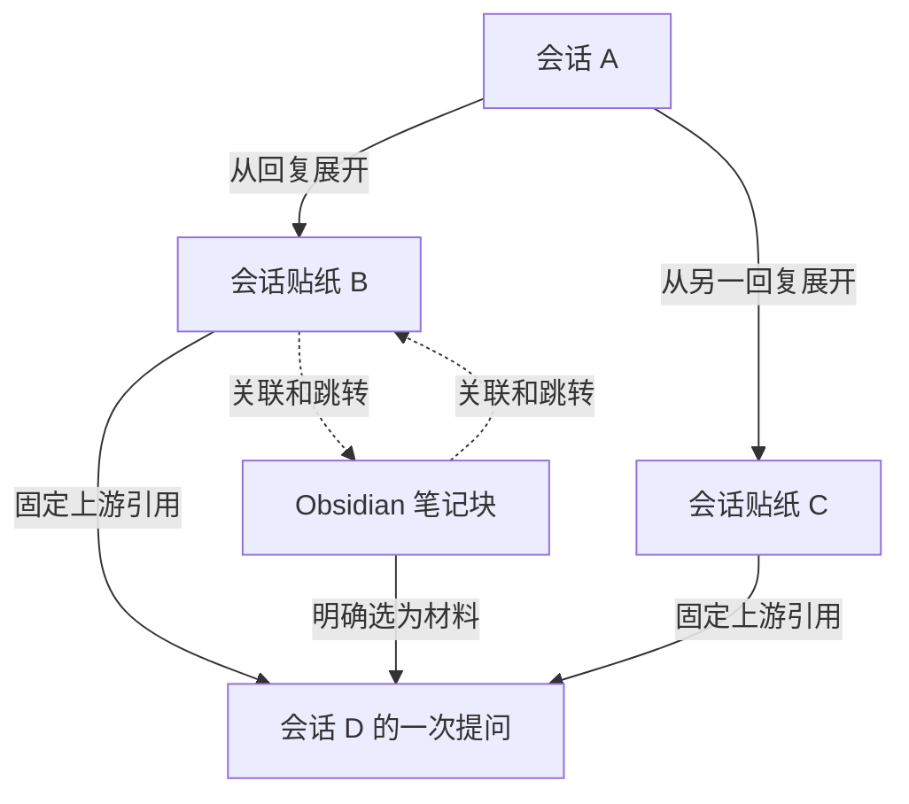

# 会话贴纸、跨会话引用与上下文关系图：设计和功能需求

日期：2026-09-10。状态：需求整理，待评审；本次只交付文档。

文档基线：Session Maintenance 提交 `5fd467922dcc8ccda0f8d740fecd3811dc6ef2fb`。该基线已包含 `fd6db7a` 的持久原生会话空间实现提交；本次没有核验副本部署或代替用户验收。可拔插扩展数据仍作为前置能力，需要实施时单独确认完成程度。

关联文档：

- [持久原生会话空间](2026-09-10-persistent-native-session-space.md)
- [可拔插扩展数据](2026-09-10-pluggable-extension-data-requirements.md)
- [插件、引擎改动清单与实施顺序](2026-09-10-session-context-graph-plugin-changes.md)

## 1. 产品目标与已确定的方向

用户在阅读会话或 Obsidian 笔记时，通过选区、引用和会话贴纸持续展开讨论。每个独立讨论仍是可以进入完整会话页、继续调用 DSH 工具的真实会话。画布将这些讨论的来源、关联和上下文依赖组织起来。

沿用 ThoughtDAG 的交互和上下文组织思想，不要求照搬其代码结构。用户可以从一条“河流”的某个位置引出支流，再把支流接入另一条会话；引用提供的是有固定上限、可以按需读取的上游范围。

以下决定以本轮讨论中最后的修正为准：

| 编号 | 已确定的需求 |
|---|---|
| D01 | 新增“会话贴纸”类型，绑定真实独立会话；点击主体进入完整会话页 |
| D02 | Annotation 提供跨会话引用能力：选段 → 跨会话引用 → 工作区 → 会话 → 跳转目标会话 → 输入框引用气泡 |
| D03 | 引用范围包括来源会话开头至被引用 AI 回复完整结束；选区只标记重点，不按字符位置截断上游 |
| D04 | 来源回复结束后固定上限，来源后续轮次不自动流入既有引用 |
| D05 | 完整上游通过后端工具披露给 AI，由 AI 按需读取；默认不把完整历史直接拼进目标提示词 |
| D06 | 会话与 Obsidian 笔记可以双向关联和跳转，笔记侧也能成为创建或挂接会话的入口 |
| D07 | 会话真源、扩展对象和 Vault 正文分开归属；插件按实例配置接入，停用保留已存对象 |
| D08 | 默认不新增逐轮上下文快照、不为每个引用复制整份会话或笔记、不强制预生成完整上游摘要 |
| D09 | 全局维护网络是后续功能；首期操作先留下稳定身份和关系记录 |

本文中的工具名称、数据字段名称、分期和异常处理细节是建议设计。固定范围、按需工具读取、数据归属和空间约束是必须满足的需求；具体预算数值等未决项见第 12 节。

## 2. 用户看到的对象和关系

### 2.1 对象

| 对象 | 含义与行为 |
|---|---|
| 原生会话 | 在 DSH Agent 环境中工作的真实会话，有自己的会话身份和后续历史 |
| 普通贴纸 | 现有批注、摘录、想法等对象，继续保留现有能力 |
| 会话贴纸 | 指向一个真实会话的卡片入口；可以新建会话后绑定，也可以绑定已有会话 |
| 上游引用 | 来源会话、固定完成位置、重点选段、目标会话及目标提交之间的关系 |
| 笔记引用 | 指向 Vault、笔记、标题或块的链接；正文仍由 Obsidian 管理 |
| 画布节点 | 对会话、贴纸、材料或笔记引用的呈现；布局对象不复制被呈现的正文 |

同一个会话可以同时出现在多个画布、多个贴纸位置和多个笔记中。这些入口指向相同逻辑会话 ID，不因多次展示新建会话副本。一个贴纸对象可以有多个呈现位置；多张独立贴纸也允许指向同一会话。

本需求中的“工作区”是 DSH/Session Maintenance 会话目录提供的项目或会话分组，不是 Git worktree，也不通过扫描任意目录推测会话归属。实例/profile 是运行归属，工作区是用户选择目标会话时的分组。

### 2.2 三种关系

| 关系 | 表达内容 | 对模型输入的作用 |
|---|---|---|
| 分支来源 | B 从 A 的某条回复展开 | 保存来源；按关联的上游引用提供读取范围 |
| 上下文引用 | Y 本轮可以查询 X 的指定上游 | 披露引用和读取工具；实际输入是工具返回的内容 |
| 知识关联 | 会话与笔记、会话与会话彼此有关 | 默认提供导航，不自动加载正文 |

分支来源可用树展示；多来源汇入同一讨论形成上下文 DAG；知识关联允许双向关系。树是展示方式，不限制多来源引用。

会话粒度上可能出现 X 引用 Y、Y 又引用 X。上下文依赖必须落在各自的固定历史位置上，不能把双方“最新全部内容”递归展开。校验依赖时使用具体引用/版本/完成位置，不能仅凭两个会话 ID 相同或相互连线就判断全部关系无效。

## 3. 功能需求：跨会话引用

### 3.1 主流程

| 编号 | 要求 |
|---|---|
| XR01 | 在 AI 回复中选中文字时，浮窗新增“跨会话引用”，保留现有划选入口 |
| XR02 | 点击后先显示工作区列表；支持鼠标滚轮，列表过长时分页或虚拟显示，不阻塞整个页面 |
| XR03 | 点击工作区后展开该分组下的会话；展示足够区分目标的标题/位置，按需加载目录元数据 |
| XR04 | 会话目录不依赖原有 200 条正文预载限制；冷历史只要属于可用会话空间，也应可发现和选择 |
| XR05 | 点击目标会话 Y 后进入 Y 的完整会话页，确保 Y 的输入框绑定完成，再添加引用气泡 |
| XR06 | 气泡显示来源、选段和“包含截至该回复完成的上游”；用户可以添加问题、编辑注解或移除待发送引用 |
| XR07 | 选择目标不自动发送、不自动启动 AI；正式发送由目标会话的正常提交动作触发 |
| XR08 | 保留目标输入框已有文字、附件和引用；同一操作重复点击、网络重试不重复创建引用 |
| XR09 | 导航或挂载失败时保留本次选区意图，显示可重试状态；不能误加到当前其它会话 |
| XR10 | 发送失败后，问题和待发送引用可恢复；发送成功后，关系绑定目标实际用户轮次 |

首期目标选择范围为当前实例已接通、可以正常打开的会话空间。跨运行实例自动启动、接管或迁移会话是后续范围；选择器不能为打开目标而偷偷复制会话到另一个实例。

工作区和会话搜索可作为增强功能，不替代用户确定的“先工作区、再会话”的基本浏览路径。返回上级时保留列表位置。

### 3.2 截止范围

| 编号 | 要求 |
|---|---|
| CUT01 | 例：选中第 12 轮 AI 回答中部，范围包括会话开头至第 12 轮完整回答，也包括该回答中选段之后的文字 |
| CUT02 | 第 13 轮及其后的消息、工具结果和由其提炼的信息不在范围内 |
| CUT03 | 记录稳定的回复/完成事件/轮次身份；不以屏幕位置、当前数组序号、临时 runId 或字符偏移定义历史上限 |
| CUT04 | 选段仍保存为重点材料；选区锚点可复用原有 Annotation 能力，但不用于上游历史截断 |
| CUT05 | 来源继续追加历史后，已发送引用保持原上限；更新为较新的上游必须建立明确的新引用修订 |
| CUT06 | 来源重写、重生成、删除、版本被清理时，不静默指向另一个“看起来相似”的回复 |

建议流式状态规则：选中仍在生成的回复时可建立待完成引用，等该回复成功结束并获得稳定身份后才能作为完整上游提交。若原回复失败或被取消，显示未完成状态；不能把重试生成的另一条回复自动当成原引用。具体禁用发送还是暂存等待由实施交互设计确定，但必须满足“上限固定后才可读取”。

回复已完成而 Maintenance 尚未完成版本登记时，先等待对应登记回执，不以不稳定的索引或另一版本替代。普通工作区浏览不因此触发旧历史的全量补投影。

## 4. 功能需求：会话贴纸

| 编号 | 要求 |
|---|---|
| ST01 | 在普通贴纸之外增加会话类型，真实会话 ID 是目标身份，不把贴纸正文伪装成会话 |
| ST02 | 支持从选区创建独立讨论，也支持挂接已有会话；二者在操作上可区分 |
| ST03 | 点击贴纸主体进入完整会话页；可另设来源/详情动作，不能只打开注释详情框 |
| ST04 | 从会话贴纸进入的会话能正常使用目标 DSH Agent 的工具、模型、项目和权限配置 |
| ST05 | 来源会话的工具权限和项目配置不因为一次内容引用而覆盖目标配置 |
| ST06 | 新讨论可继续通过引用或选区生成子讨论，并保留分支来源关系 |
| ST07 | 多处展示同一会话不会产生多份原生历史；重启后仍能解析相同会话身份 |
| ST08 | 删除一个卡片位置、解除一个引用、删除贴纸对象、删除真实会话是不同操作 |
| ST09 | 关闭画布或移除入口不会关闭、归档或删除其目标会话 |

“继承上游”在本设计中表示新讨论可读取该固定上游范围。推荐新建真实会话并挂接上游引用，以按需工具读取实现；不要求把全部原文预填入新会话提示词。

已有 Sidechat 的原生 fork 保留自己的完整历史继承语义。会话贴纸创建不得直接复用其“默认归档隐藏、只在侧栏继续”的行为。若以后增加“原生完整 fork”选项，应单独标示，并核对其原生历史与引用材料是否重复；两种实现不能无说明地互换。

## 5. 功能需求：Obsidian 与画布

### 5.1 Obsidian 双向入口

| 编号 | 要求 |
|---|---|
| OB01 | 会话或会话内选段可以关联 Vault 的笔记、标题或块 |
| OB02 | 笔记侧可以选段创建会话贴纸、挂接已有会话、打开目标会话 |
| OB03 | 会话侧能回到来源笔记，笔记侧能打开目标完整会话并按需定位回复 |
| OB04 | 笔记移动或重命名后，使用现有 Vault/块身份能力继续解析；无法唯一定位时显示异常 |
| OB05 | “建立关联”和“选作模型材料”分别表达；双链本身不将整个笔记或所有关联会话送进模型 |
| OB06 | 解除某处双链只解除该链接；不删除其它笔记的链接、目标会话或笔记正文 |

复用现有 Obsidian Bridge 的协议跳转和原生反向链接能力。Vault 继续保存笔记正文；不为实现上下文图而复制整座 Vault。对笔记修改后当时正文能否还原，沿用已有“不新增完整快照”的约束。

### 5.2 ThoughtDAG 与后续维护网络

| 编号 | 要求 |
|---|---|
| GR01 | 画布可以展示会话节点、选段材料、会话贴纸和笔记引用，并区分三类连线 |
| GR02 | 会话节点折叠时显示概要，展开时按需展示被引用的回复或材料；不默认铺开所有轮次 |
| GR03 | 普通引用和创建贴纸操作即可产生关系；用户不必先打开画布才有关系记录 |
| GR04 | 会话的多来源合流通过多个引用表达，不伪造双亲原生会话版本或重写原始问答 |
| GR05 | 画布控制可用上下文来源；AI 通过统一工具读取，画布中存在一条边不代表模型已读完整来源 |
| GR06 | 解除或停用上下文引用关系影响后续读取；仅移除画布呈现不解除该关系，已进入目标历史的材料及其影响按既有会话语义保留 |
| GR07 | 布局、节点呈现和编辑状态通过 ThoughtDAG 扩展 Adapter 保存；浏览器缓存不能成为无规则的第二真源 |
| GR08 | 历史会话发现和打开遵守 DSH 当前实例的持久化配置，不写死 `$DSH_HOME/sessions` |
| GR09 | ThoughtDAG 停用时，Annotation 跨会话引用和后端读取仍可独立工作 |

全局维护网络的自动聚合、跨画布检索、影响传播、自动重新回答和网络治理界面放在后续阶段。首期保留实现这些能力所需的稳定引用，不预先运行全局递归分析。

## 6. 后端工具与上下文容量

### 6.1 AI 的使用流程

目标提交携带用户问题、重点选文、有界的来源说明、引用 ID 和读取指引。完整上游保留在会话真源中。AI 应在依赖选文之外的上游事实前调用工具；不得将“已建立引用”解释为“已读取全部上游”。

建议首期工具 Interface：

| 工具 | 输入要点 | 返回与约束 |
|---|---|---|
| `read_reference` | `referenceId`、可选游标、可选轮次数/返回预算 | 首次从引用截止位置附近开始；返回轮次或内容分段、稳定来源定位、是否还有内容及下一游标 |
| `search_reference` | `referenceId`、查询、可选游标/返回预算 | 只检索固定上游，返回有界命中片段和可交给读取工具的位置 |

名称和参数是草案，不代表现有工具已经实现。公开 Interface 保持简洁，截止解析、版本映射、目录读取、预算和缓存放在后端 Module 内；前端、ThoughtDAG 和 Obsidian 复用同一语义。

### 6.2 必须满足的读取规则

| 编号 | 要求 |
|---|---|
| RD01 | 后端按引用 ID 解析来源、目标和固定上限；不能由 AI 任意增大上限 |
| RD02 | 读取、搜索、目录摘要、派生缓存均受相同上限约束；不得从最新全会话摘要泄漏后续轮次的信息 |
| RD03 | 只有本实例接通的能力和当前目标会话关联的引用可被该工具使用；引用不扩大目标 Agent 的运行权限 |
| RD04 | 支持长单条回复的继续读取，不能只按轮次分页后永远无法读到被截掉的后半段 |
| RD05 | 单次返回限制覆盖普通问答、工具参数、工具输出、搜索命中、来源说明及序列化开销 |
| RD06 | 设置本轮累计引用读取预算；并发读取共享预算，换引用、重试或换游标不能重置预算 |
| RD07 | 预算根据目标模型容量、已有历史、系统和工具定义、本轮问题及输出预留计算；容量无法确定时使用保守上限 |
| RD08 | 到达上限时返回有界说明、覆盖范围和继续方式；不静默把截断结果当成完整历史 |
| RD09 | 重叠上游可复用索引或缓存，保留多条来源关系；不因多处连线重复展开整份共同历史 |
| RD10 | 历史内若含其它引用，默认返回引用描述而不自动递归展开；后续显式追溯也共享预算并防止循环 |
| RD11 | 用户选文过长时也受容量检查；可分段读取或提示缩小/摘要，不能因为它是选文就突破限制 |
| RD12 | 新增引用工具只读来源；读取不启动源会话 Agent，不发送消息，不改写源历史 |

跨多轮积累的工具结果仍需目标 DSH 自身的历史管理和压缩能力。引用工具不能仅靠分页宣称“永不超出上下文窗口”。

前端不要求用户每轮手工选择模型实际读取的页面。普通工具调用记录用于查看 AI 读了哪些范围；详细的上下文输入审计界面不是首期前置条件。

### 6.3 与 Codex 核查结果的关系

2026-09-10 对本机 Codex 26.903.8094.0 的静态核查确认：任务引用先提供身份并指示模型调用 `read_thread`；该工具默认读取 1 轮，支持游标，默认不带工具输出。在核查路径中，普通问答正文没有套用可选工具输出的字符截断，所以只能确认按需读取可以减少初始加载，不能证明绝不超限。

官方 [App Server 读取和分页说明](https://learn.chatgpt.com/docs/app-server#list-thread-turns) 提供按轮次分页及不同条目视图；[会话压缩说明](https://learn.chatgpt.com/docs/app-server#trigger-thread-compaction) 描述独立压缩能力。本设计借鉴读取机制，并增加固定上限和总量控制，不依赖 Codex 工具或要求复制其实现。

## 7. 数据归属与扩展接入

| 数据 | 权威归属 | 保存要求 |
|---|---|---|
| 会话消息、回答、工具执行及既有版本 | Session Maintenance 会话真源 | DSH 原生历史为配置到实例的运行副本 |
| 跨会话引用、选区重点、提交关系 | Annotation 扩展数据域 | 保存逻辑身份、截止位置、目标提交与状态；不复制完整上游 |
| 会话贴纸及其它贴纸对象 | Sticker 扩展数据域 | 保存对象和目标会话引用；遵守既有数据迁移规则 |
| 画布、节点呈现、连线与布局 | ThoughtDAG 扩展数据域 | 使用通用对象/关系身份引用会话和其它扩展对象 |
| 笔记正文 | Obsidian Vault | 由 Obsidian 原生方式读取和编辑 |
| 知识链接与同步状态 | Obsidian 引用扩展数据域 | 链接记录与笔记正文分别归属 |

由扩展 Adapter 解释各自对象和迁移规则；DSH 版本 Adapter 负责原生格式、稳定身份和运行兼容。两类 Adapter 分开注册。

统一存储可以管理命名空间、版本、删除与恢复，不要求每个插件建立独立数据库。会话真源核心不添加 ThoughtDAG 颜色、节点坐标或 Obsidian 块等专用字段。

同一语义关系只有一个权威对象：跨会话上下文关系由 Annotation 引用对象表达，笔记关联由 Obsidian 引用对象表达。ThoughtDAG 对已有关系的线条只保存关系 ID 和呈现状态；在画布中创建或解除关系时调用对应领域的统一接口，不另存一套相互独立的上下文语义。纯布局线可以由 ThoughtDAG 自己保存，但不能因此获得上游读取能力。

接入相应插件后，Maintenance 扩展区域出现对应面板；停用能力保留对象，缺少 Adapter 时显示通用元数据和不可用原因。正文、会话内容和画布对象均按需读取，不因面板出现而全量加载。

建议引用对象至少表达：`referenceId`、schema/对象修订、来源逻辑会话 ID、可解析的既有源版本及完成位置、重点选文或选区身份、目标逻辑会话 ID、目标提交身份、状态。具体 DTO 在实现时集中定义，禁止各插件复制不一致的协议。

当前旧版 Sticker/Bridge 仍有 Vault 为贴纸或引用真源的实现。接入统一扩展数据前，必须完成对象对应、写入权切换和双链校验，不能同时启用两个无协调的权威写入者，也不能直接删除旧笔记内容来完成迁移。

## 8. 生命周期、异常和空间约束

引用草稿与已发送引用分开管理。建议状态为待来源完成、可提交、提交中、已发送、失败/已解除；状态对应已有 Annotation 提交流程，不另建相互冲突的状态机。

- 创建/提交使用幂等身份，关系在目标实际提交成功后绑定；失败保留可恢复草稿。
- 来源缺失或版本不可读时返回明确状态，不取最新版本顶替；能够恢复既有来源后可重新解析。
- 解除引用阻止后续通过该关系读取；既有真实聊天记录按原有维护语义保留。
- 画布编辑、卡片移动、笔记链接删除不级联删除真实会话。
- 所有操作沿用受控的插件/Engine Interface；平台文件格式只由版本 Adapter 解释。
- 不修改源会话已经完成的历史来伪造分支或合流；现有插件历史事件不能在解耦时直接清除。

容量规则：

- 引用优先指向已存在的会话版本；不为每次引用复制完整原生目录、画布或笔记。
- 不强制为每条引用、每轮请求或每次渲染生成摘要与完整快照。
- 如增加读取缓存或按需摘要缓存，必须有容量上限、去重、失效和清理策略；缓存不是第二真源。
- 引用不默认永久钉住全部源版本。既有保留策略清理版本后，可以显示版本不可用；长期证据保存以后单独设计。
- 正常会话原本会保留的问答和工具记录仍按原系统规则保存，不额外建立一套上下文备份仓库。

## 9. 分期建议

| 阶段 | 交付范围 | 验收重点 |
|---|---|---|
| P0 前置确认 | 持久原生空间可用；扩展对象、稳定身份和插件能力注册达到最小可用程度 | 不把已有实现提交等同于副本已验收 |
| P1 跨会话引用 | Annotation/Sidechat 入口、工作区会话选择、目标气泡、固定上限、后端读取与检索、预算 | 不安装 ThoughtDAG 也能完整工作 |
| P2 会话贴纸与双向笔记 | 新建/挂接真实会话、完整页跳转、Obsidian 双向关联、旧对象迁移 | 对象与会话身份稳定，解除链接不删正文 |
| P3 ThoughtDAG 适配 | 展示已有关系、按需展开节点、统一保存、连线语义和持久目录适配 | 画布复用后端能力，不再造上下文读取体系 |
| P4 全局维护网络 | 跨画布整理、全局检索、网络治理及以后决定的影响分析 | 另行设计，不作为本轮首期交付条件 |

先前扩展数据文档要求用两个真实数据域验证 Interface，仍然有效；不要求在 P1 前完成整个 ThoughtDAG 产品。

## 10. 验收需求

以下为未来实现验收，未声称已经通过。自动检查使用合成会话和标记的临时目录；副本交互验收由用户执行。

| 编号 | 场景 | 预期结果 |
|---|---|---|
| AC01 | 多工作区、长会话列表 | 工作区先展示，滚轮可用，展开按需加载 |
| AC02 | 超过 200 条历史，选择冷会话 | 可发现、可正常打开，不依赖正文预载阈值 |
| AC03 | Y 已有草稿和附件 | 跳转加入气泡后原草稿/附件保留，不自动发送 |
| AC04 | 点击重复、挂载延迟或导航失败 | 引用不重复、不进入错误会话，失败可恢复 |
| AC05 | 选第 12 轮回答中段，之后还有第 13 轮 | 第 12 轮后半回答可读，第 13 轮通过读取/搜索/摘要均不可见 |
| AC06 | 引用时来源正在流式输出 | 完成后固定上限；失败或取消不冒充完整回复 |
| AC07 | 来源后续追加或重生成 | 既有引用保持原范围，无法解析时明确失败 |
| AC08 | 发送跨会话引用 | 初始请求只有有界选文和引用描述，完整上游通过工具获取 |
| AC09 | 长单条回复或大工具参数/输出 | 单次与总预算有效，超长正文可继续分段读取 |
| AC10 | 多引用并发、重试和不断翻页 | 共享预算，不能通过换游标规避上限 |
| AC11 | 多条引用有共同上游或相互引用 | 不自动递归膨胀，来源关系保留，无无限循环 |
| AC12 | AI 根据来源作出结论 | 先读取需要的范围，工具记录能区分实际已读与未读 |
| AC13 | 会话贴纸打开、重启、多处展示 | 进入真实会话页，身份不变，不新增历史副本 |
| AC14 | 新贴纸会话调用工具 | 使用目标实例正常 Agent 环境，不复制来源权限或模型配置 |
| AC15 | 移除卡片/关系呈现或解除一处笔记链接 | 会话、笔记和其它链接保留；仅移除呈现不解除其语义关系 |
| AC16 | Obsidian 两侧入口及笔记移动 | 可回跳并定位，不能唯一解析时不误跳 |
| AC17 | 同时启用旧桥接与新扩展数据接入 | 对象归属明确，无双写争抢和重复对象 |
| AC18 | ThoughtDAG 停用/重新启用 | 跨会话引用继续可用，图数据保留并可恢复显示 |
| AC19 | 固定原生目录位于非默认路径 | 通过当前实例持久化 Interface 找到会话 |
| AC20 | 批量引用、重启、反复打开面板 | 不产生逐次完整快照，缓存和对象加载有界 |
| AC21 | 源版本按原保留策略清理 | 显示来源不可用，不悄悄读取最新版本或无限保留备份 |
| AC22 | 发送失败、断线重试、目标删除 | 状态可解释，无幽灵关系和错误目标提交 |

## 11. 本轮不做的功能

不实现或部署上述插件改动；不自动启动/迁移其它运行实例；不修改 DSH 官方源码作为默认接入方式；不生成全局维护网络；不自动重跑受上游变化影响的回答；不新建逐轮上下文备份系统；不引入 EAC 或 `dsh-codex-session-sync` 运行兼容。

## 12. 后续需要确定的参数与实现选择

1. 单次读取、单轮累计预算及回答预留的具体数值，按目标模型验证后定，不从 Codex 默认值直接照搬。
2. 流式待完成引用的交互、失败重试和发送按钮表现。
3. 会话贴纸首期是否同时提供原生完整 fork 选项；按需上游引用是本设计推荐的基本路径。
4. 上下文引用在后续轮次的默认可用期，以及用户从已发送引用中管理启用/停用的入口；实现时必须明确，不允许草稿删除与已发送关系混为一谈。
5. 旧 Vault 对象迁移批次、写入权切换和兼容版本范围。
6. 后续跨实例引用、全局关系管理、按需摘要和长期证据保留是否进入后续阶段。
