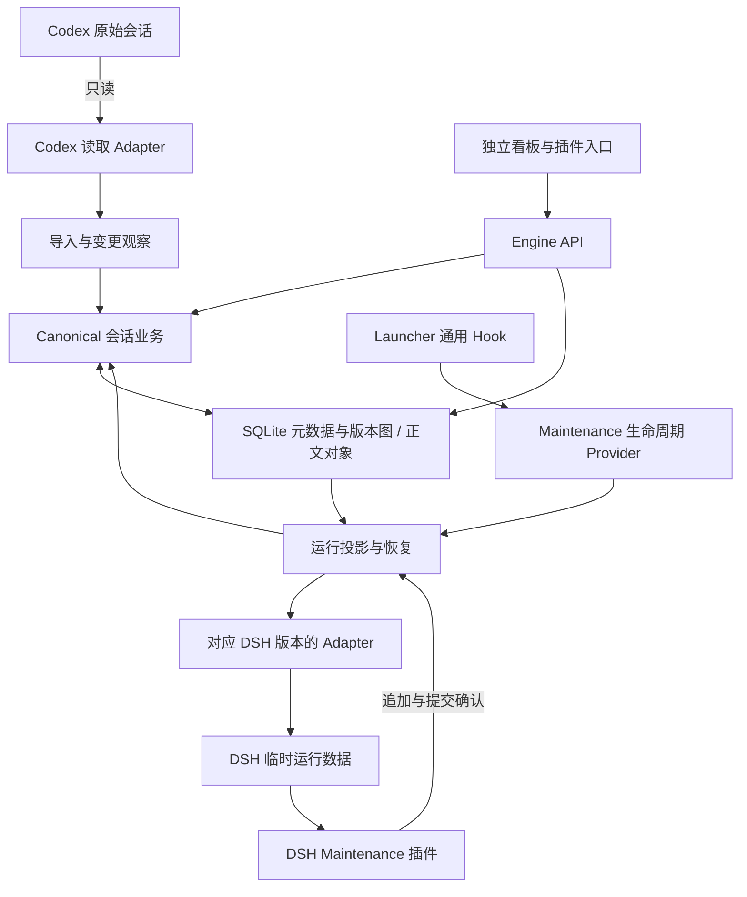

# Session Maintenance：架构、存储保留与看板复核

核查日期：2026-09-05，Asia/Shanghai。源码基线：`4b499271e9b8bc09de09f0dab3c5321d25f0104c`。本轮看板候选提交：`a6b4053`。

## 结论

当前功能可以继续保留。Canonical 真源、平台 Adapter、运行投影、DSH 接入插件和 Launcher 生命周期入口的总体分工合理，适合继续作为一个仓库、一个本地服务内部的模块化结构。需要改进的是数据访问和业务规则的边界、写入成本以及存储保留机制。没有证据支持为了架构整洁而将这些部分全部拆成独立服务或独立仓库。

本报告聚焦 `@linmu/dsh-session-maintenance-engine` 和配套 `dsh-session-maintenance` 插件。另一个负责插件部署、环境 Generation 和资源登记的 `dsh-maintenance-engine` 是不同系统；其 Web 看板与本次会话看板故障应分别处理。

## 1. 指定会话末尾是否修改过 Maintenance

核对任务：[查找并改造浮窗会话插件 (3)](codex://threads/01a065f1-b6c7-7113-b2e4-5712e8ddc20b)。任务工具返回的最近消息正文为空，因此进一步读取了该任务对应本地记录中的完成消息。以最后的结果和当前源码共同判断，而非仅依赖早期报告。

| 时间 | 实际结果 | 对本轮的约束 |
| --- | --- | --- |
| 20:13 | 已提交并部署 Maintenance `4b49927`：Engine 0.1.14、入口插件 0.2.16；配套 SCM 0.3.1 | 以这个提交为基线，保留已落地修复 |
| 20:21 | 用户验证新建会话和同名会话归属；随后只读检查确认测试删除产生真源墓碑、隐藏投影且无待提交操作 | 早期变更说明里的“待用户验收”已被后续会话记录更新 |
| 20:40 | 核对 Launcher 四阶段 Hook 和运行同步分工；没有修改或重启 | 沿用其边界判断，不重新改变运行接入 |
| 20:54 | 建议通用 Hook 向 Launcher 上游贡献，Maintenance Provider 随自身项目发布；指出 README 定位过时 | 这次也是建议与说明，没有新增 Maintenance 代码修改 |

`4b49927` 主要修复两条链路：

1. 删除使用“用户选中的原生会话 ID → 当前已证明身份的运行 → Canonical 逻辑会话 ID”，直接得到删除回执后再隐藏会话，不依赖标题猜测，也不删除 Codex 原始会话。
2. RC1 复用空会话时，通过官方会话生命周期完成必要的持久化准备，解决 `session/not-found`；没有伪造消息或取消引用系统的校验。

依据：[既有变更报告](/D:/AI/DSH-Plugin-Repositories/dsh-session-maintenance/docs/changes/RC1-SCM-IDENTITY-AND-EMPTY-SESSION.md)、[身份解析](/D:/AI/DSH-Plugin-Repositories/dsh-session-maintenance/apps/engine/src/http/projection-identity.ts)、[插件运行接入](/D:/AI/DSH-Plugin-Repositories/dsh-session-maintenance/plugins/dsh-session-maintenance/src/projection-runtime.ts)。

本轮修改位于独立工作树 `D:/AI/DSH-Plugin-Repositories/.worktrees/maintenance-dashboard-audit-20260905`，分支 `codex/maintenance-dashboard-audit-20260905`。只修改 Engine 的看板目录发现逻辑，并增加测试和变更说明；没有改上述身份、删除、空会话代码。主工作目录仍为 `4b49927`，保持干净。Launcher 的 `runtime-hook-seam` 工作树仍有五个文件的既有未提交修改，本轮未触碰。

## 2. 当前模块及相互关系

图中 API 直达存储表示当前实现；写操作经过统一会话业务、读取经过查询接口，是建议收紧的边界。

| 模块 | 当前职责与主要位置 | 耦合判断与建议 |
| --- | --- | --- |
| 共享契约与会话领域 | `contracts`、`session-domain`：统一 ID、事件、摘要、版本图、差异、规范化 | 保留统一契约；不要让每个 Adapter 再定义另一套会话身份 |
| Canonical 会话业务 | `canonical-session-engine`：观察 Codex、接收 DSH 追加、首次续写派生、逻辑删除 | 主要依赖契约与领域层，方向合理；继续通过存储接口协作 |
| 元数据、版本与正文存储 | `session-store`：SQLite、对象压缩、版本边、Checkpoint、仓库与迁移实现 | 版本和存储应协同，但索引、不可变正文、保留策略应有各自接口；通用 repository 已接近 2,000 行，宜按职责拆文件 |
| Codex 源读取与导入 | `adapter-codex-read`、`codex-canonical-import.ts`、导入脚本与热导入流程 | “源格式读取”和“导入调度”应分开。Codex 是只读来源；不应把其路径、格式或扫描规则塞入 Launcher 或 DSH Adapter |
| DSH 版本 Adapter | SDK、Host、alpha2 / RC1 / RC2 Adapter | 按实际格式分包合理。负责探测、生成投影、规范化追加、校验及定位，不负责全局会话归属、墓碑或 SQLite |
| 运行投影与同步 | `projection-lifecycle`：运行租约、投影准备、增量变化、WAL、确认、停止与恢复 | 生命周期状态需要统一管理；可拆内部准备、提交、恢复、缓存组件。把其中的 SQLite 查询实现移回存储层 |
| DSH 接入插件 | `plugins/dsh-session-maintenance`：绑定官方运行生命周期、按需载入、捕获追加、向 Engine 提交、提供界面入口 | 主运行文件约 1,186 行，可按运行身份、按需载入、追加确认、界面代理拆内部模块；保留刚修好的 RC1 空会话行为 |
| Maintenance 生命周期 Provider | `external-lifecycle-provider.ts`、Runtime Broker：响应启动与退出通知，准备运行数据 | 是 Maintenance 的宿主接入层，留在同仓库合理；它调用投影服务，不自行建立第二份会话规则 |
| Launcher Hook | Launcher 的外部生命周期模块，提供 prepare / beforeStop / afterExit / abort | 只关心启动、停止和失败回收。当前业务边界合理；宿主补丁仍需要版本管理与升级验证 |
| WebUI 与入口 | `apps/dashboard`、本地 API client、`session-ui`、插件菜单/设置页 | 界面通过命令和查询接口访问 Engine；页面可独立构建，服务端不能遗漏其启动装载 |
| 延续与交接 | `continuation-engine`、handoff context、`adapter-codex-continuation` | 与 Codex 只读导入不同，是明确发起的延续任务；保持独立用例与预算规则 |
| 支撑与维护 | Jobs、状态日志、实例登记、迁移/修复、旧事务写入通道 | 状态日志、运行垃圾回收、备份和迁移的保留期应分别管理；修复脚本也应遵守统一写入调度 |

“会话同步”实际上横跨导入、Canonical 提交、投影准备和 DSH 运行回写，不宜再做一个包揽所有细节的巨型同步模块。

当前已经有历史淘汰的 Native Mirror 路径保护测试。Codex 镜像应继续走现有只读导入和 Canonical 观察流程，不应恢复旧 `native-mirror-engine` 运行链。早期 RC2 Gateway/事务写入通道也不等于现在 RC1 的 Canonical 投影回写；当前 Engine 启动没有开启那个旧 Gateway 写入选项。

依据：[Adapter 边界文档](/D:/AI/DSH-Plugin-Repositories/dsh-session-maintenance/docs/adapters/architecture.md)、[Engine 组装](/D:/AI/DSH-Plugin-Repositories/dsh-session-maintenance/apps/engine/src/composition-root.ts)、[停用旧镜像链的约束测试](/D:/AI/DSH-Plugin-Repositories/dsh-session-maintenance/tests/contract/no-native-mirror-runtime.test.ts)。

## 3. 原报告的问题重述与本轮解决方向

以下区分已确认缺陷、源码体现的成本，以及架构风险；没有把未经测量的性能推断写成真实延迟。

| 项目 | 复核结论 | 解决方向与验收 |
| --- | --- | --- |
| E01 / P1：历史版本元数据不独立 | 当前 `getVersion` 的正文来自历史对象，但标题、标签、归档状态取自当前会话；旧报告已有合成复现，`4b49927` 中实现仍相同。历史元数据可以与保存的摘要不一致，派生基线也可能受影响 | 每个版本保存完整元数据快照；读取时验证快照摘要。迁移能恢复的旧快照，无法还原者明确标记，不把今天的标题冒充历史。测试改名、改标签、归档后读取旧版和从旧版派生 |
| P02 / P2：追加仍承担全历史成本 | 每次追加读取/解压旧正文、组合与散列全部事件、同步压缩整正文，并删除重建当前会话事件索引 | 先在旧前缀验证一致时只追加索引，规范化改变时保留全量重建；再引入不可变事件分块与版本清单复用，压缩移出请求主线程，详情支持范围读取。验收提交 P50/P95、写入量、对象新增字节、恢复正确性 |
| W01 / P1：看板地址存在但服务未装载 | 实际 Engine 健康接口 200；带认证访问 `/dashboard/` 为 404；页面构建存在，启动却未传 `--dashboard-root` | 本轮已完成自动定位构建目录的小补丁，见第 6 节。仍需在正常停机窗口切换运行构建，并验收真实插件入口 |
| A01 / P2：看板 HTTP 模块承担领域写入规则 | `http/dashboard.ts` 直接完成元数据更新、墓碑、删除前 Checkpoint 和投影模式变更；删除入口已被其他 API 复用 | 抽取统一会话命令服务和独立查询接口。HTTP、插件、看板调用相同命令。保留最新“精确身份 → 原子删除 → 回执”顺序与 pending-write 策略 |
| A02 / P2：投影编排层直接知道 SQLite | `SqliteCanonicalProjectionSource` 位于投影包并直接查询 Canonical 表 | 投影层保留所需读接口，SQL 实现移到 `session-store`；让投影无需了解表布局。验证准备结果、变更游标和缓存行为相同 |
| A03 / P2：Adapter 注册与运行实例选择重复 | Host 有注册表，组装处仍有两组硬编码的 alpha2 / RC1 / RC2 选择；Host 还引用具体 SQLite Registry 类型 | 统一登记“清单、探测、工厂/运行实现”；Host 依赖仓库接口。新增 Adapter 不再修改多组选择分支；未知版本仍明确拒绝 |
| A04 / P2：运行接入文件过大 | 投影生命周期和插件运行接入均超过千行，包含准备、缓存、提交和收尾 | 按状态职责拆内部组件，保留一个协调生命周期的入口和共享运行身份；不按每个阶段拆独立进程。用已有恢复与空会话回归约束迁移 |
| A05 / P2：在线 Engine 与维护脚本有多个写入入口 | `sync-codex-canonical.mjs` 自行打开维护库并建立 Engine/Store；不是调用已运行 Engine 的作业接口 | 在线导入统一进入 Engine Job/命令入口；脱机修复需要明确独占条件与租约。此处确认的是入口分散风险，尚未复现并发写坏数据 |
| A06 / P2：保留策略没有形成完整业务模块 | 对象存储已有 `collect`、dry-run、引用集合和年龄阈值；源码检索未找到把业务保留根完整计算后接入日常运行的调用链 | 在 Engine/Store 边界增加保留规划：先解释保护原因与预计空间，再按运行租约执行引用安全的回收；底层已有 GC 可复用 |
| D01 / P2：文档仍混用早期与当前架构 | README 仍主要描述 RC2 Gateway 和正式 Profile 尚未替换；当前已运行 RC1 Canonical 投影体系 | 更新产品首页、当前支持矩阵、使用文档及 Adapter/Hook 接入文档，和另一会话 20:54 建议合并为一项文档工作 |

关键源码：[历史读取](/D:/AI/DSH-Plugin-Repositories/dsh-session-maintenance/packages/session-store/src/canonical-engine-store.ts:104)、[索引重建](/D:/AI/DSH-Plugin-Repositories/dsh-session-maintenance/packages/session-store/src/canonical-engine-store.ts:330)、[追加处理](/D:/AI/DSH-Plugin-Repositories/dsh-session-maintenance/packages/canonical-session-engine/src/dsh-append.ts:174)、[同步压缩](/D:/AI/DSH-Plugin-Repositories/dsh-session-maintenance/packages/session-store/src/object-store.ts:69)、[看板删除规则](/D:/AI/DSH-Plugin-Repositories/dsh-session-maintenance/apps/engine/src/http/dashboard.ts:416)、[投影 SQL](/D:/AI/DSH-Plugin-Repositories/dsh-session-maintenance/packages/projection-lifecycle/src/materialize.ts:523)、[重复 Adapter 选择](/D:/AI/DSH-Plugin-Repositories/dsh-session-maintenance/apps/engine/src/composition-root.ts:264)、[独立导入脚本](/D:/AI/DSH-Plugin-Repositories/dsh-session-maintenance/scripts/sync-codex-canonical.mjs)、[GC 原语](/D:/AI/DSH-Plugin-Repositories/dsh-session-maintenance/packages/session-store/src/object-store.ts:121)。

原报告 U01 需要拆开更新：旧的删除全局接口和按标题决定删除目标的问题，已由 SCM 0.3.1 与 `4b49927` 修复，不能继续作为当前未修复缺陷。菜单入口共享仍有整理价值：当前安装的 SCM 仍在捕获阶段拦截右键，而 Maintenance 的自有菜单在冒泡阶段监听。对双方同时识别的行，Maintenance 专有入口仍可能被遮蔽；本轮未点击真实页面复验。建议由一个菜单宿主登记各模块动作，继续复用已修复的身份接口。它与已证实的看板 HTTP 404 是两个不同问题。

## 4. Launcher 与同步应该怎样解耦

四个时机的职责应继续保持：启动前准备投影；正常停止前提交与收尾；退出后处理恢复；启动失败撤销准备。运行期间，Maintenance 插件监听 DSH 会话事件并直接与 Engine 通信，每条消息不需要经过 Launcher。

`prepare` 主要消费 Maintenance 已有真源更新 DSH 投影，不等于每次启动完整扫描并导入 Codex。当前组装中的 `beforeProjectionPrepare` 额外执行 Codex 标题目录同步；新内容的导入属于另一条流程。这两种同步在文档和状态页上应显示为不同状态，避免把“投影已准备”当成“Codex 已追到最新”。

建议保留一个带版本号的宿主生命周期协议。Launcher 只维护调用时机、配置、超时、退出码和失败回收；Maintenance Provider 留在本仓库实现业务。未来可提炼通用 Hook 向上游贡献，暂未进入上游时保存清晰的小补丁分支及适用 Launcher 版本。配置文件在程序外不代表宿主接口不会被升级覆盖。

验收围绕未启用 Hook、正常启动/停止、准备超时、子进程退出、启动失败、重复通知、协议版本不兼容，以及再次启动后正确恢复；不要让 Hook 学会会话 SQL、Codex 扫描或版本保留规则。

## 5. 五天版本窗口与实际存储压力

### 5.1 当前存储是什么

当前是 SQLite 中的版本关系图和按内容摘要保存的压缩正文对象，已经具有不可变版本与共享对象的基础；并非使用真实 Git 仓库存放会话。Checkpoint 是对一个或多个版本的命名引用，不能与每次提交产生的版本记录等同。源代码仓库的 Git 提交历史也不属于本轮会话保留策略。

五天细粒度历史窗口合理，但不能将“五天以前创建的会话/版本”直接等同于垃圾。即使换成 Git，常规 `git gc` 也不会仅因为提交日期旧就删除仍被引用的历史；浅历史需要明确的边界语义。[Git GC 官方说明](https://git-scm.com/docs/git-gc)、[浅历史说明](https://git-scm.com/docs/shallow)

### 5.2 只读统计

SQL 使用只读连接及 `query_only`，目录统计只读取文件信息。统计时间约为 20:55–21:10；运行中数据可能继续变化。GB / MB 使用十进制，数值不代表可以全部释放的空间。

| 项目 | 大小 / 数量 | 含义 |
| --- | --- | --- |
| 投影运行记录 `projection-runtime/runs` | 约 7.40 GB | 应首先按运行结束、恢复和隔离状态分析保留原因 |
| 持久化投影缓存 `projection-runtime/caches` | 约 270 MB | 与运行记录不同；当前缓存还承担加速启动作用 |
| `backups` | 约 4.03 GB | 独立备份保留策略，不随会话版本年龄直接删除 |
| 根目录所有 SQLite / WAL / SHM | 约 4.59 GB | 包含活动库及多份旧候选/备份库；不是活动库自身大小 |
| 活动数据库 | 约 567 MB | 已包含在上一行；不是额外 567 MB |
| 压缩正文对象 | 约 3.00 GB，8,017 个文件 | 可能被当前库和需要保留的旧库共同引用 |
| 三份 conversation-plan 目录 | 合计约 660 MB | 修复候选产物，需独立判断是否仍用于恢复 |
| 逻辑会话 | 519 个，其中未删除 339 个 | 五天窗口应保留仍需使用的全部会话内容 |
| 历史版本 | 5,626 个，其中 1,976 个早于五天 | 年龄不等于可删除；还要排除保护根和业务引用 |
| 未删除会话中，当前版本早于五天 | 309 个 | 直接按日期清版本会命中大量仍需保留的当前会话 |

活动 SQLite 内，`canonical_events` 最新事件索引表约 **453 MB**，`session_versions` 版本记录表约 **6.54 MB**，运行状态事件表约 **38.4 MB**。这说明只减少版本表的行数，无法解决大部分现有占用；历史版本正文、运行副本、旧库和备份必须一并治理。

当前运行状态：1 个 running、2 个 closed、36 个 recovered、37 个 quarantined。隔离运行不能直接当成已经安全完成的运行清除；须先确认待恢复写入及其引用。即使都是五天内数据，没有容量上限也仍可能快速增长。

此前其他工作已经做过一批明确旧库的删除与活动库压缩，本轮没有重复执行。SQLite 删除记录和回收文件空间也不是同一步；压缩需要安排适当的维护时机。[SQLite VACUUM 官方说明](https://www.sqlite.org/lang_vacuum.html)

证据：[完整存储统计](/C:/Users/19717/OneDrive/文档/ChatGPT/dsh/diagnostics/plugin-engine-audit-20260905/maintenance-storage-evidence.json)、[投影与旧库拆分统计](/C:/Users/19717/OneDrive/文档/ChatGPT/dsh/diagnostics/plugin-engine-audit-20260905/maintenance-storage-breakdown.json)。

### 5.3 推荐的保留规则

| 数据 | 推荐规则 |
| --- | --- |
| 每个保留会话的当前版本与完整内容 | 长期保留，不按最后活跃日期丢弃 |
| 最近五天普通修订 | 保留逐次版本、比较和回退能力；五天作为可配置默认值 |
| 更早普通修订 | 可压缩为稀疏检查点/冷基线；没有业务引用的旧正文才进入回收候选 |
| 手动 Checkpoint、明确固定版本 | 按用户保留意图保护，不自动被五天窗口覆盖 |
| 派生基线、运行基线、未完成提交和恢复证据 | 在对应引用或恢复任务解除之前保留 |
| 删除恢复窗口内的版本 | 保留到恢复承诺结束；先处理自动 Checkpoint 与墓碑关系 |
| 已安全结束的运行目录 | 设置独立短期保留规则，并验证回执已落盘且无待恢复内容 |
| 可重建投影缓存 | 容量上限与最近使用策略；不与当前活跃运行争用回收 |
| 自动备份、旧候选库、修复产物 | 按有效性、数量上限和时间保留；回收正文对象时须纳入仍保留的库 |

实现时先产生只读计划，列出“预计释放字节、保护原因、依赖的旧库、运行是否允许执行”。再在适当运行状态下确定一份稳定的引用视图，标记仍需保留的正文对象，延迟回收已无引用的对象。不能只看文件修改时间，也不能只从活动库计算可达对象后清空其他恢复库依赖的正文。

版本 ID 的计算包含父版本等摘要信息，不能为了裁剪历史直接改写已有版本的父指针。可先保留轻量版本关系、对已移除正文显式记录“历史已裁剪”；若要建立新的历史边界，需要单独的迁移规则和 API/UI 语义。最终的事件分块可让保留版本共享旧内容，减少每次追加复制整段历史的放大成本。

第一版不必立即实现复杂冷存储：先补全元数据快照、引用安全的回收计划与运行/备份治理，再落地五天细历史窗口；之后根据实际追加负载决定分块和压缩调度。无法仅凭目前目录总量承诺五天窗口能释放多少 GB，需要逐对象引用分析。

## 6. 看板故障与本轮补丁

实际监听进程的启动参数是 `serve`，没有 `--dashboard-root`。健康 API 正常，Dashboard 构建文件也存在，但 CLI 原来只在明确传入这个参数时挂载静态服务。因此带认证访问看板仍为 404，这是已确认的直接原因；没有把未经观察的浏览器弹窗拦截当成根因。

补丁相对 Engine 自身安装位置查找 `apps/dashboard/dist` 或便携包相邻的 `dashboard`。显式目录优先，缺少显式指定的构建时提前报错；有意不携带 UI 的安装仍可启动。不依赖启动时的工作目录，不放宽业务 API 认证。

- 分支：`codex/maintenance-dashboard-audit-20260905`。
- 提交：`a6b4053`，基于并保留 `4b49927`。
- 7 个相关测试文件，共 20 项通过；Engine 类型检查及构建通过。
- 完整 CLI 使用带标记的临时状态启动，不传看板参数，页面与应用脚本均 200，健康 API 200，未认证业务请求仍为 401。
- 没有升级版本号、部署、推送、修改运行配置或重启真实实例；检查时仍有 1 个活动运行。线上旧进程的看板故障尚未因源码补丁自动消失。
- 切换构建应等待正常停止和待提交写入排空，再验证实际插件入口与页面内容。本轮未宣称完成真实浏览器验收。

补丁：[目录发现逻辑](/D:/AI/DSH-Plugin-Repositories/.worktrees/maintenance-dashboard-audit-20260905/apps/engine/src/dashboard-root.ts)、[回归测试](/D:/AI/DSH-Plugin-Repositories/.worktrees/maintenance-dashboard-audit-20260905/apps/engine/test/dashboard-root.test.ts)、[变更说明](/D:/AI/DSH-Plugin-Repositories/.worktrees/maintenance-dashboard-audit-20260905/docs/changes/DASHBOARD-DEFAULT-ROOT-20260905.md)。

## 7. 推荐落地顺序

1. 在正常停机窗口交付看板小修复；统一当前架构和支持版本文档，纳入另一会话已提出的定位整理。
2. 修复 E01 元数据快照；补写入/读取摘要往返与历史派生回归；评估旧版本哪些可恢复真实元数据。
3. 建立统一会话命令和存储读接口，迁移看板写入、投影 SQL 与重复 Adapter 选择；每步保持既有身份、回执和恢复行为。
4. 先提交只读存储回收计划与依赖统计，优先治理已安全结束运行、旧备份和候选产物；再执行五天细历史窗口。
5. 优化追加索引，测量真实会话长度下的写入量和耗时，再推进不可变分块、后台压缩及详情范围读取。

这一顺序保留现有满意的功能，把变更集中在已确认的故障、历史正确性和可测量的维护成本。除第 6 节的小补丁外，本报告的架构与保留方案尚未实施，也没有删除任何真实会话、版本、对象、缓存或备份。
